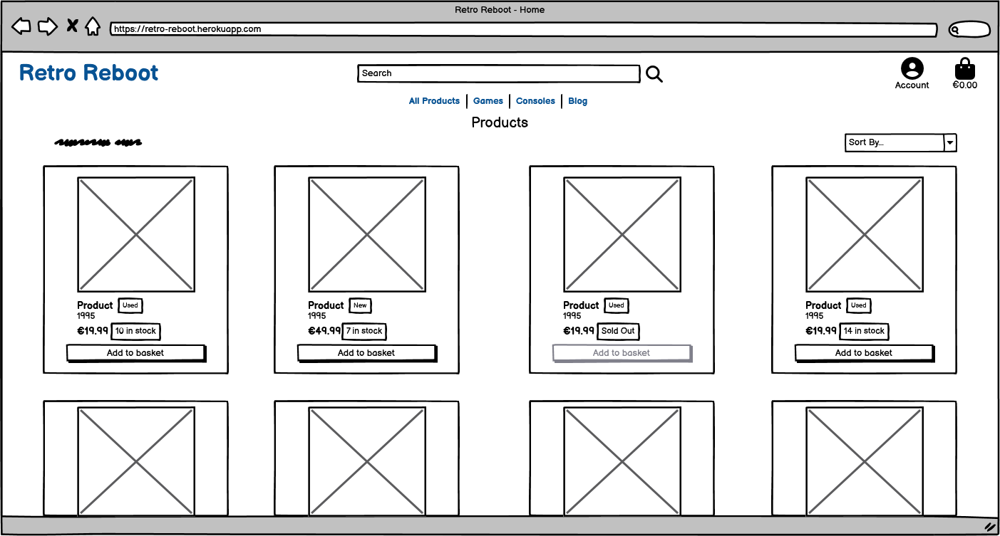
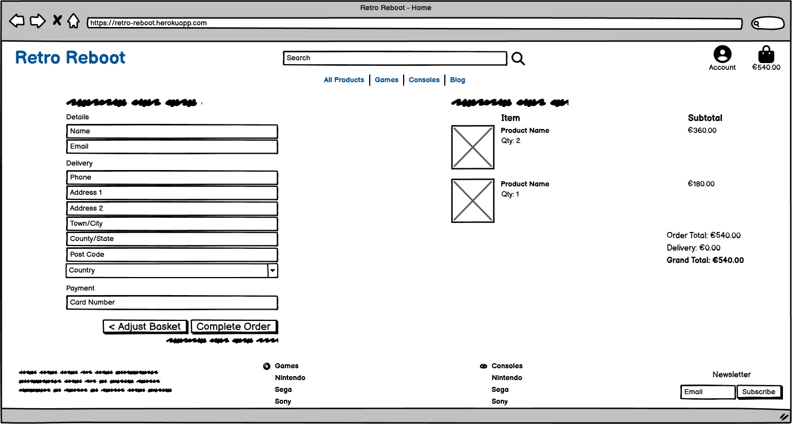

# RETRO REBOOT

Welcome to Retro Reboot. An e-commerce site dedicated to providing gamers with a selection of retro video games and consoles to purchase.

## UX

When designing this site, I wanted to keep it pretty basic. Over complicating the design of an e-commerce store risks a bad user experience which is the last thing you want when trying to entice a user to become a customer.

On visiting the site, user's are greeted with a large image showing various retro video game consoles along with the website's tagline "Classic games, modern convenience" and a button to begin their shopping experience with a link to the products page. While this may seem like little information, it provides the user with everything they need to know at this stage of their journey. What the site is about, why they should shop with us, and how to dive straight in to view our products.

I wanted the site to flow nicely with the user being able to add items to their basket from both the all products and individual product pages. The user has access to their basket at all times with it being embedded in the nav menu which appears on every page of the site.

The user can always see the running total of their basket as they browse the site and add items to the basket. This builds trust with the user as many site will try to hide this until the checkout stage to coax the user into over spending.

The site is very easy to navigate through the main nav menu. The site has been built to make it very easy for users to access games and consoles for specific platforms at the click of a link with products being able to be filtered into both game and console categories for each platform we supply.

There are links in the site's footer to filter the products by games/consoles too making this information even more accessible for the user. The footer also contains a link to the contact page and a form to sign up to our newsletter.

I've included an easter egg in the site for diehard retro gamers. When a user type's the famous "Konami code" into the site, a sound will play and a message will pop up for the user. This creates an even deeper connection with the user as they browse the site.

Overall,  I feel the user experience on the site is very strong with the site being so easy to use and the flow being so good.

### Colour Scheme

I wanted to give the site a retro feel so decided to use bright neon-like colours across the site with a dark background. I feel like the dark background makes elements on the site pop nicely to give the user an elevated experience as they browse what we have to offer.

- `#0d0d11` used for the site background.
- `#E84610` used for primary text across the site.
- `#00bfc3` used for secondary text.
- `#ffd33b` used for highlights including headers.
- `#ff2273` used for secondary highlights such as borders around cards and the homepage button.

I used [coolors.co](https://coolors.co/f5f5f5-0d0d11-ff2273-ffd33b-00bfc3) to generate my colour palette.


I've used CSS `:root` variables to easily update the global colour scheme by changing only one value, instead of everywhere in the CSS file.

```css
:root {
    --off-white: #f5f5f5;
    --main-dark: #0d0d11;
    --main-pink: #ff2273;
    --main-yellow: #ffd33b;
    --main-teal: #00bfc3;
}
```

### Typography

When choosing fonts for the site, my main goal was to choose fonts that were easily readable for users. 

- [Caprasimo](https://fonts.google.com/specimen/Caprasimo) was used for the logo text in the main nav bar and the large text on the home page.

- [Montserrat](https://fonts.google.com/specimen/Montserrat) was used for all other text.

- [Font Awesome](https://fontawesome.com) icons were used throughout the site, such as the social media icons in the footer.

## User Stories

To help with the development of this project, I created user stories to map out tasks I needed to achieve in order to build the website to a good standard. I further split these user stories into epics in order to take an agile approach to its development.

View a full list of user stories [here](https://github.com/adamgilroy22/retro-reboot/issues?q=is%3Aissue+label%3A%22User+Story%22).

### EPIC 1: General Site Functionality

- As a first-time site visitor I want to be able to clearly see what the site's purpose is so that I can decide whether or not to continue browsing it. `(MUST HAVE)`
- As a user I want to be able to easily navigate the website so that I can find the content I'm looking for. `(MUST HAVE)`
- As a site user I want to be able to search the website so that I can find specific products and see if the site has them in stock. `(SHOULD HAVE)`
- As a site user I want to be able to contact the site owners so that I can request further information about the site or lodge a complaint. `(COULD HAVE)`

### EPIC 2: Products

- As a site user I want to be able to see a list of all site products so that I can browse what the site has to offer. `(MUST HAVE)`
- As a site user I want to be able to see the prices of products clearly so that I can make a decision whether or not to purchase. `(MUST HAVE)`
- As a site user I want to be able to view a product on its own individual page so that I can see more information about the product. `(MUST HAVE)`
- As a site user I want to be able to sort products by category (game/console or games by console) so that I can find specific products related to the category I select. `(SHOULD HAVE)`

### EPIC 3: Ordering/Cart Management

- As a site user I want to be able to add products to my shopping basket so that I can proceed to the checkout and purchase them. `(MUST HAVE)`
- As a site user I want to be able to see a running total of the items in my basket so that I can manage my spending and know what to expect at the checkout. `(MUST HAVE)`
- As a site user I want to be able to checkout with a card payment so that I can place an order for the items in my basket. `(MUST HAVE)`
- As a site user I want to be able to receive an order confirmation email after I purchase from the shop so that I can have a record of what I've purchased in my email inbox. `(SHOULD HAVE)`
- As a site user I want to be able to apply discount codes in the checkout so that I can receive a discount on my purchase. `(COULD HAVE)`

### EPIC 4: Site User Accounts

- As a site user I want to be able to create an account on the site so that I can save my billing and shipping details and see a history of my purchases on my account. `(MUST HAVE)`
- As a registered site user I want to be able to add products to a wish list so that I can keep a collection of items I am interested in buying in the future. `(WONT HAVE)`
- As a registered user I want to be able to edit the details saved to my account so that I can keep my details up to date. `(SHOULD HAVE)`

### EPIC 5: Blog

- As a site user I want to be able to view blog posts on the website so that I can read any posts I feel are relevant to me. `(COULD HAVE)`
- As a site admin I want to be able to create blog posts from the front end so that I can share information with site visitors. `(COULD HAVE)`
- As a site admin I want to be able to edit existing blog posts so that I can ensure that posts are up to date and relevant without having to create them from scratch in case of error. `(COULD HAVE)`
- As a site admin I want to be able to delete existing blog posts so that I can remove any unwanted posts from the site. `(COULD HAVE)`

### EPIC 6: Site Admin

- As a site admin I want to be able to create new products from the front end so that I can easily add new products to the site. `(SHOULD HAVE)`
- As a site admin I want to be able to edit existing products so that I can ensure that all product listings are up to date and accurate. `(SHOULD HAVE)`
- As a site admin I want to be able to delete products from the site so that I can remove any products that are no longer being supplied by the site. `(SHOULD HAVE)`
- As a site admin I want to be able to set the stock for each product so that I can manage how many units of each product the site can sell. `(SHOULD HAVE)`
- As a site admin I want to be able to see a list of open tickets so that I can manage contact form inquiries. `(COULD HAVE)`

### EPIC 7: SEO & Marketing

- As a site user I want to be able to sign up for the site's mailing list so that I can receive offers and news in my inbox. `(COULD HAVE)`
- As a site user I want to be able to spin a discount wheel so that I can receive a discount code pending on the outcome of the wheel. `(WONT HAVE)`
- As a site user I want to be able to enter the Konami code (Up Up Down Down Left Right Left Right B A) on my keyboard so that I can experience an easter egg. `(COULD HAVE)`
- As a site admin I want to be able to send marketing emails to people who signed up to the mailing list so that I can send out updates and offers to their inboxes. `(COULD HAVE)`
- As a site admin I want to be able to set appropriate keywords on site pages so that I can increase the chances potential customers will find the site when searching to purchase records on Google. `(MUST HAVE)`
- As a site admin I want to be able to share the business on Facebook so that I can reach and market to a larger audience. `(SHOULD HAVE)`

## Wireframes

To help with the design of the site, I created wireframes for each page. To follow best practice, wireframes were developed for mobile, tablet, and desktop sizes.
I've used [Balsamiq](https://balsamiq.com/wireframes) to design my site wireframes.

### Home Page Wireframes

<details>
<summary>Click to View Home Page wireframes</summary>

#### Mobile


#### Tablet


#### Desktop


</details>

### Sign Up Page Wireframes

<details>
<summary>Click to View Sign Up Page wireframes</summary>

#### Mobile


#### Tablet


#### Desktop


</details>

### Sign In Page Wireframes

<details>
<summary>Click to View Sign In Page wireframes</summary>

#### Mobile


#### Tablet


#### Desktop


</details>

### All Products Page Wireframes

<details>
<summary>Click to View All Products Page wireframes</summary>

#### Mobile


#### Tablet


#### Desktop


</details>

### Product Detail Page Wireframes

<details>
<summary>Click to View Product Detail Page wireframes</summary>

#### Mobile


#### Tablet


#### Desktop


</details>

### Basket Page Wireframes

<details>
<summary>Click to View Basket Page wireframes</summary>

#### Mobile


#### Tablet


#### Desktop


</details>

### Checkout Page Wireframes

<details>
<summary>Click to View Checkout Page wireframes</summary>

#### Mobile


#### Tablet


#### Desktop


</details>

### Checkout Success Page Wireframes

<details>
<summary>Click to View Checkout Success Page wireframes</summary>

#### Mobile


#### Tablet


#### Desktop


</details>

### Contact Page Wireframes

<details>
<summary>Click to View Contact Page wireframes</summary>

#### Mobile


#### Tablet


#### Desktop


</details>

### Blog Page Wireframes

<details>
<summary>Click to View Blog Page wireframes</summary>

#### Mobile


#### Tablet


#### Desktop


</details>

### Blog Post Wireframes

<details>
<summary>Click to View Blog Post wireframes</summary>

#### Mobile


#### Tablet


#### Desktop


</details>

### Open Tickets Page Wireframes

<details>
<summary>Click to View Open Tickets Page wireframes</summary>

#### Mobile


#### Tablet


#### Desktop


</details>

### Sign Out Page Wireframes

<details>
<summary>Click to View Sign Out Page wireframes</summary>

#### Mobile


#### Tablet


#### Desktop


</details>

## Features

### Existing Features

- **Landing Page**

    - This is the page a user lands on when arriving at the site. It welcomes them to the site and gives them an idea of what the site sells. A button is present that will bring the user to the site's product page.


- **All Products Page**

    - This is a page containing all products that the site sells.


- **Product Card**

    - Each product has its own card which contains the product's condition, image, name, platform, release year and price.


- **Condition Banner**

    - This appears on every product to let the user know whether the product is brand new and in its original box or second hand.


- **Product Stock Count**

    - Every product has a finite stock and the amount of stock left for each product is displayed clearly for the user to let them know they'll need to act fast if the product they want to purchase is low on stock.
    - Products with more than 10 stock left have a green badge with the stock count displayed.
	- If the product has less than 10 stock left then the badge displaying the count is turned yellow to add a sense of urgency.
	- When a product is purchased, the stock will automatically decrease by the number of units of each product the customer purchases.
	- When a product's stock reaches 0, the stock count is replaced with a sold out badge and the Add to basket button is disabled so product is not able to be added to the user's basket.


- **Add to basket button**

    - Every product has a button that lets the user to add it to their basket when viewing it both on the all products page or the individual product page. This adds one unit of the product to the user's basket and they can increase the quantity from their basket if they want to purchase more than one.


- **Product Sorting**

    - When the user is viewing the all products page, they can sort the products in a number of ways. Products can be sorted by: Price (low to high), Price (high to low), Name (A-Z), Name (Z-A), Year (oldest to newest), Year (newest to oldest), Platform (A-Z), Platform (Z-A)


- **Main Nav Menu**

    - Throughout the whole site the user has access to the main nav menu. Features include a search bar, account/profile access, basket link and running total if the user has items added to their baskets and links to filter products by platform and category as well as a link to the site's blog,


- **Product Filtering**

    - Through the nav menu, a user can sort and filter products. All products can be sorted by price, platform and release year and if the user wants to see products specific to a game or console they can sort both of these by platform (Nintendo, Sega, Sony and Arcade).


- **Search Bar**

    - Users can use the nav menu's search bar to find specific products. The search term is matched up with products' name and description to give the user a list of products to match their search term.
	- The user can also see how many results were returned for their search term.


- **Individual Product Page**

    - Each product also has its own individual page for the user to see more information about the product including a description for every game and console on the site. Similar to the all products page, the product's image, name, release year and price appear on the individual page along with buttons to add the product to the user's basket or to return to the all products page and keep shopping.


- **Product Quantity Selectors**

    - Each individual product page contains a quantity selector if the product is in stock.
    - The selector lets the user add a minimum of 1 and a maximum of whatever the product's current stock is to their basket.
    - After setting the quantity, a user can click the add to basket button to add that number of the product to their basket.


- **My Account Dropdown**

    - If the user is logged in, the my account dropdown in the nav menu will contain a link to the user's profile.
	- If the user isn't logged in they will be given the option to either register for an account or sign in to an existing account. 


- **User Sign Up**

    - Users without an account can register for one through the register link in the main nav menu. This will present them with a form to add their details and created a profile for that user on completion.
	- Users are sent a confirmation email to complete their account sign up to help avoid people from creating spam accounts on the site.


- **User Sign In**

    - If a user isn't signed in to the site but has a profile, they can follow the sign in link where they're presented with a log in page. They must input their username or email address and correct password to do so. There's also a checkbox to let the user be remembered on their current device to avoid having to log in every time they visit the site.
	- There's a link for users who have forgotten their password.


- **Password Reset**

    - If a user is trying to log in and has forgotten their password they can visit the password reset page. Here a user must enter their email address they used to sign up with and an email will be sent to them with further instructions on resetting their password to regain access to their account.


- **User Profile**

    - When a user has completed registration on the site, they are given a profile. The profile is pretty simple in that it contains the user's default delivery information if set and a list of the user's previous orders


- **Default Deliver Information Form**

    - On the user's profile there is a form containing the user's default delivery information if the user has saved it. The user can update this information from their profile by altering the form and clicking the update information button. This information will be automatically used for the user's next purchase to make the site easier to use for customers.


- **Order History**

    - Users can view a list with their full order history on their profiles. The data is displayed in a table with each row including the order number, time and date of purchase, items included in the order and the total of each order.
	- The order number contains a link which when the user clicks on it, they are brought to the order confirmation page for that specific order which contains all the details for that order and a link to return to the user's profile.


- **Site Footer**

    - This appears across the whole site and contains links to the blog, contact us page, social media pages on the left.
    - Two columns with links to games and consoles by platform in the middle.
    - A form to subscribe to the newsletter on the right.


- **Newsletter**

    - Using the form in the footer, users can sign up to the site's newsletter where on submission, they will be sent a welcome email containing an exclusive discount code to use on the site.
    - Users can only sign up to the newsletter once and if they try to sign up with an already registered email address, they will see a message letting them know.


- **Contact Us Page**

    - This page can be accessed from the footer across the site and contains a map of Cork which is where the business is located and a contact us form.


- **Contact Us Form**

    - This is a simple form that a user can fill out to contact the site owners.
    - When the form is submitted, the user is sent an automated email confirming that their message has been seen and that a member of the team will follow up with them.
    - A ticket is created using the Ticket model with the information from the form with the seen field set to false as default.


- **Ticket Management**

    - Admins can view a list of open tickets on a page accessed through the nav menu. This page lists all tickets where the seen field in the model is equal to false.
    - Once admins have viewed/dealt with open tickets, they can click the button to close the ticket. This will set the seen field to true and it will no longer appear in the list of open tickets.
    - The heading shows a count of the amount of open tickets if there are some and a message shows up if there are no open tickets letting the admin know so.


- **Blog**

    - The blog contains a list of articles to do with retro gaming and caring for products that are sold on the site.
    - Each post has a main image, title, excerpt, author, like count and when the post was published.
    - Users can click on a post to read the full thing.
    - If the logged in user is an admin, edit and delete icons are present to either change or remove the post.


- **Blog Post**

    - Each post has an individual page where users can read the full post, like the post or leave a comment.
    - Under the post is a list of comments left by users.


- **Blog Comments**

    - There's a form on each blog post page for users to comment on a post.
    - When the form is submitted users are given a message confirming so.
    - Comments are approved by default but if an admin sees a comment that isn't appropriate they can be removed by changing the comment's approved status to false.


- **Add Blog Post Page**

    - Admin's can add a new post to the blog by clicking "Add new blog post" in the site's nav menu.
    - This brings them to a page containing a form to create a new post.
    - The admin must fill out the Title, Content, Excerpt and select an image for the post.
    - The Slug for the post will auto fill as the admin types the Title.
    - The post author is automatically set to be the current logged in admin who is creating the post.


- **Edit Blog Post Page**

    - Admin's can edit blog posts by selecting the edit icon on a post.
    - This shows a form containing the current data for the post and allows the admin to edit.


- **Delete Blog Post Page**

    - Admin's can also delete blog posts from the front end by selecting the delete icon. This will bring them to a confirmation page to delete the post to avoid any accidental data loss.


- **Basket**

    - The basket can be accessed from the main nav menu.
    - In the menu a running total is shown of the items in the user's basket.
    - When the user clicks on this they can see all the items in their basket, individual price of each product, subtotal per product if the quantity is greater than 1 and a quantity selector for each product with buttons to update the quantity or remove the product completely from their basket.
    - If a user doesn't have anything in their basket, a message will appear prompting the user to continue shopping.


- **Basket Quantity Selector**

    - Similar to the quantity selector in the individual product page, users can adjust the quantity of a product already in their basket.
    - If the users sets the quantity to 0 or clicks the remove button, the product will be completely removed from their basket.
    - The user can add a maximum of the product's stock to their basket from here the same as on the individual product page.


- **Basket Total**

    - This is the amount that the user's basket comes to after all the products and their quantities are added together.


- **Delivery Cost**

    - Under the basket total, the user can see their delivery cost. If their basket comes to over €50 then delivery is free, otherwise it's calculated at 10% of their order.


- **Discount Code Form**

    - If a user has a discount code, they can add it in their basket to receive a percentage off their order.
    - If a user enters a code that doesn't exist they will see a message telling them so.
    - If the code they use does exist, they will see a message confirming the discount has been added and the form will be replaced with the amount that has been taken off their order.
    - The form is removed when a discount has been added to avoid users stacking discounts.
    - If a user removes their current discount then the form will appear again.


- **Discount Amount**

    - When a user successfully adds a discount code, the amount that has been taken off is displayed in red text in place of the discount code form.
    - A delete icon appears next to the discount amount if the user wants to use a different discount code and on clicking, a message appears confirming the discount has been removed and the discount code form will appear in place of the discount amount.


- **Grand Total**

    - At the bottom of the basket page a user can see their grand total.
    - This is the final total they will be charged and is calculated by adding their basket total to their shipping costs if they haven't met the free shipping criteria and taking away whatever percentage discount if they used a discount code.


- **Basket Buttons**

    - After the grand total, users will see two buttons, one to continue shopping and one to continue to the checkout.


- **Checkout**

    - The final step of the users shopping journey on the site is the checkout page.
    - This page contains a form for the user's delivery and payment information and a summary of the user's order.
    - If the user has an account on the site, they can save their delivery information on their profile to automatically be filled in the checkout.


- **Customer Details Form**

    - In the checkout the user can add their details and if they're logged in, can check the box to save their details for future transactions.
    - Users must enter their payment information before completing the checkout and all payments are handled via Stripe.


- **Order Summary**

    - A final summary of the user's order is shown containing all the user's basket items, quantity and subtotal for each item.
    - The user can also see their order total, delivery costs, any discounts that have been applied and the grand total in the summary.


- **Checkout Buttons**

    - At the very end of the checkout the user will see two buttons, one to adjust their basket and another to complete their order.
    - The grand total is displayed under the complete order button to further inform the user of how much their card will be charged on order completion.


- **Order Confirmation Email**

    - Once the order is complete and payment has been received, the user will receive an order confirmation email containing their order number and a receipt with the total paid.


- **Order Confirmation Page**

    - After the order has been completed, the user is redirected to a confirmation page letting them know an order confirmation email has been sent to their provided email address.
    - This page contains a final rundown of the order and what the user purchased.
    - This page can be accessed again from the user's profile if they have an account on the site by clicking the order number from the list of past orders.


- **Konami Code Easter Egg**

    - I've hidden an easter egg in the site when a user enters the famous "Konami Code" (Up, Up, Down, Down, Left, Right, Left, Right, B, A) on their keyboard anywhere on the site.
    - When the user types the code in, a sound is played and a modal box appears giving them an exclusive discount code to use in their basket.
    - This feature currently only works on devices connected to a keyboard.


### Future Features

While I feel that the site has an abundance of features, there are several ones I would like to add in the future that didn't fit into the current development cycle for this project. These features have been logged as Won't Have in my MoSCoW prioritization.

- Discount Wheel
    - I want to add a spin the wheel game to the site where a user can input their email address to try and win a discount code. Emails would be collected and added to the newsletter list enticing users to sign up for the mailing list.
- Wishlists
    - I would like to have a wishlist system implemented on the site where users can save products they would like to purchase in the future and receive email updates on if the price is changed or the stock goes below a certain number.
- Product Reviews
    - I would like to implement a review system to the site where users who have purchased a specific product can review it with a star based system with all site users being able to see the average star rating for each product.

## Tools & Technologies Used

This site couldn't have been created without a variety of tools and technologies. I've listed the ones used below.

- [HTML](https://en.wikipedia.org/wiki/HTML) used for the main site content.
- [CSS](https://en.wikipedia.org/wiki/CSS) used for the main site design and layout.
- [CSS :root variables](https://www.w3schools.com/css/css3_variables.asp) used for reusable styles throughout the site.
- [CSS Flexbox](https://www.w3schools.com/css/css3_flexbox.asp) used for an enhanced responsive layout.
- [CSS Grid](https://www.w3schools.com/css/css_grid.asp) used for an enhanced responsive layout.
- [JavaScript](https://www.javascript.com) used for user interaction on the site.
- [Python](https://www.python.org) used as the back-end programming language.
- [Git](https://git-scm.com) used for version control. (`git add`, `git commit`, `git push`)
- [GitHub](https://github.com) used for secure online code storage.
- [GitHub Pages](https://pages.github.com) used for hosting the deployed front-end site.
- [Gitpod](https://gitpod.io) used as a cloud-based IDE for development.
- [Bootstrap](https://getbootstrap.com) used as the front-end CSS framework for modern responsiveness and pre-built components.
- [Materialize](https://materializecss.com) used as the front-end CSS framework for modern responsiveness and pre-built components.
- [Flask](https://flask.palletsprojects.com) used as the Python framework for the site.
- [Django](https://www.djangoproject.com) used as the Python framework for the site.
- [MongoDB](https://www.mongodb.com) used as the non-relational database management with Flask.
- [SQLAlchemy](https://www.sqlalchemy.org) used as the relational database management with Flask.
- [PostgreSQL](https://www.postgresql.org) used as the relational database management.
- [ElephantSQL](https://www.elephantsql.com) used as the Postgres database.
- [Heroku](https://www.heroku.com) used for hosting the deployed back-end site.
- [Cloudinary](https://cloudinary.com) used for online static file storage.
- [Stripe](https://stripe.com) used for online secure payments of ecommerce products/services.
- [AWS S3](https://aws.amazon.com/s3) used for online static file storage.

## Database Design

Entity Relationship Diagrams (ERD) help to visualize database architecture before creating models.
Understanding the relationships between different tables can save time later in the project.

⚠️⚠️⚠️⚠️⚠️ START OF NOTES (to be deleted) ⚠️⚠️⚠️⚠️⚠️

Using your defined models (one example below), create an ERD with the relationships identified.

🛑🛑🛑🛑🛑 END OF NOTES (to be deleted) 🛑🛑🛑🛑🛑

```python
class Product(models.Model):
    category = models.ForeignKey(
        "Category", null=True, blank=True, on_delete=models.SET_NULL)
    sku = models.CharField(max_length=254, null=True, blank=True)
    name = models.CharField(max_length=254)
    description = models.TextField()
    has_sizes = models.BooleanField(default=False, null=True, blank=True)
    price = models.DecimalField(max_digits=6, decimal_places=2)
    rating = models.DecimalField(
        max_digits=6, decimal_places=2, null=True, blank=True)
    image_url = models.URLField(max_length=1024, null=True, blank=True)
    image = models.ImageField(null=True, blank=True)

    def __str__(self):
        return self.name
```

⚠️⚠️⚠️⚠️⚠️ START OF NOTES (to be deleted) ⚠️⚠️⚠️⚠️⚠️

A couple recommendations for building free ERDs:
- [Draw.io](https://draw.io)
- [Lucidchart](https://www.lucidchart.com/pages/ER-diagram-symbols-and-meaning)

🛑🛑🛑🛑🛑 END OF NOTES (to be deleted) 🛑🛑🛑🛑🛑


⚠️⚠️⚠️⚠️⚠️ START OF NOTES (to be deleted) ⚠️⚠️⚠️⚠️⚠️

Using Markdown formatting to represent an example ERD table using the Product model above:

🛑🛑🛑🛑🛑 END OF NOTES (to be deleted) 🛑🛑🛑🛑🛑

- Table: **Product**

    | **PK** | **id** (unique) | Type | Notes |
    | --- | --- | --- | --- |
    | **FK** | category | ForeignKey | FK to **Category** model |
    | | sku | CharField | |
    | | name | CharField | |
    | | description | TextField | |
    | | has_sizes | BooleanField | |
    | | price | DecimalField | |
    | | rating | DecimalField | |
    | | image_url | URLField | |
    | | image | ImageField | |

## Agile Development Process

### GitHub Projects

[GitHub Projects](https://github.com/adamgilroy22/retro-reboot/projects) served as an Agile tool for this project.
It isn't a specialized tool, but with the right tags and project creation/issue assignments, it can be made to work.

Through it, user stories, issues, and milestone tasks were planned, then tracked on a weekly basis using the basic Kanban board.

⚠️⚠️⚠️⚠️⚠️ START OF NOTES (to be deleted) ⚠️⚠️⚠️⚠️⚠️

Consider adding a basic screenshot of your Projects Board.

🛑🛑🛑🛑🛑 END OF NOTES (to be deleted) 🛑🛑🛑🛑🛑


### GitHub Issues

[GitHub Issues](https://github.com/adamgilroy22/retro-reboot/issues) served as an another Agile tool.
There, I used my own **User Story Template** to manage user stories.

It also helped to keep on top of my [milestones](https://github.com/adamgilroy22/retro-reboot/milestones) for the project.

⚠️⚠️⚠️⚠️⚠️ START OF NOTES (to be deleted) ⚠️⚠️⚠️⚠️⚠️

Consider adding a screenshot of your Open and Closed Issues.

🛑🛑🛑🛑🛑 END OF NOTES (to be deleted) 🛑🛑🛑🛑🛑

- [Open Issues](https://github.com/adamgilroy22/retro-reboot/issues)

    

- [Closed Issues](https://github.com/adamgilroy22/retro-reboot/issues?q=is%3Aissue+is%3Aclosed)

    

### MoSCoW Prioritization

I've decomposed my Epics into stories prior to prioritizing and implementing them.
Using this approach, I was able to apply the MoSCow prioritization and labels to my user stories within the Issues tab.

- **Must Have**: guaranteed to be delivered (*max 60% of stories*)
- **Should Have**: adds significant value, but not vital (*the rest ~20% of stories*)
- **Could Have**: has small impact if left out (*20% of stories*)
- **Won't Have**: not a priority for this iteration

## Ecommerce Business Model

This site sells goods to individual customers, and therefore follows a `Business to Customer` model.
It is of the simplest **B2C** forms, as it focuses on individual transactions, and doesn't need anything
such as monthly/annual subscriptions.

It is still in its early development stages, although it already has a newsletter, and links for social media marketing.

Social media can potentially build a community of users around the business, and boost site visitor numbers,
especially when using larger platforms such a Facebook.

A newsletter list can be used by the business to send regular messages to site users.
For example, what items are on special offer, new items in stock,
updates to business hours, notifications of events, and much more!

## Search Engine Optimization (SEO) & Social Media Marketing

### Keywords

I've identified some appropriate keywords to align with my site, that should help users
when searching online to find my page easily from a search engine.
This included a series of the following keyword types

- Short-tail (head terms) keywords
- Long-tail keywords

I also played around with [Word Tracker](https://www.wordtracker.com) a bit
to check the frequency of some of my site's primary keywords (only until the free trial expired).

### Sitemap

I've used [XML-Sitemaps](https://www.xml-sitemaps.com) to generate a sitemap.xml file.
This was generated using my deployed site URL: https://retro-reboot.herokuapp.com

After it finished crawling the entire site, it created a
[sitemap.xml](sitemap.xml) which I've downloaded and included in the repository.

### Robots

I've created the [robots.txt](robots.txt) file at the root-level.
Inside, I've included the default settings:

```
User-agent: *
Disallow:
Sitemap: https://retro-reboot.herokuapp.com/sitemap.xml
```

Further links for future implementation:
- [Google search console](https://search.google.com/search-console)
- [Creating and submitting a sitemap](https://developers.google.com/search/docs/advanced/sitemaps/build-sitemap)
- [Managing your sitemaps and using sitemaps reports](https://support.google.com/webmasters/answer/7451001)
- [Testing the robots.txt file](https://support.google.com/webmasters/answer/6062598)

### Social Media Marketing

Creating a strong social base (with participation) and linking that to the business site can help drive sales.
Using more popular providers with a wider user base, such as Facebook, typically maximizes site views.

I've created a mockup Facebook business account using the
[Balsamiq template](https://code-institute-org.github.io/5P-Assessments-Handbook/files/Facebook_Mockups.zip)
provided by Code Institute.


### Newsletter Marketing

I have incorporate a newsletter sign-up form on my application, to allow users to supply their
email address if they are interested in learning more about what the business has to offer.

I created a custom newsletter app in my project with a custom NewsletterSignup model and added a form to the site's footer to collect user email addresses 

Newsletter model:

```python
class NewsletterSignup(models.Model):
    email = models.EmailField(unique=True, null=False, blank=False)

def __str__(self):
    return self.email
```

I set the email address to be unique to avoid users signing up multiple times with the same email address. If a user tries to sign up twice with the same address they will be shown a message letting them know they've already signed up.

Once a user signs up, I used the `send_mail()` functionality in the `webhook_handler.py` file to trigger a welcome email for the user to acknowledge that they've successfully signed up for the newsletter.

In this welcome newsletter, I've included a special discount code to entice sign ups to purchase on the site.

## Testing

For all testing, please refer to the [TESTING.md](TESTING.md) file.

## Deployment

The live deployed application can be found deployed on [Heroku](https://retro-reboot.herokuapp.com).

### ElephantSQL Database

This project uses [ElephantSQL](https://www.elephantsql.com) for the PostgreSQL Database.

To obtain your own Postgres Database, sign-up with your GitHub account, then follow these steps:
- Click **Create New Instance** to start a new database.
- Provide a name (this is commonly the name of the project: retro-reboot).
- Select the **Tiny Turtle (Free)** plan.
- You can leave the **Tags** blank.
- Select the **Region** and **Data Center** closest to you.
- Once created, click on the new database name, where you can view the database URL and Password.

### Amazon AWS

This project uses [AWS](https://aws.amazon.com) to store media and static files online, due to the fact that Heroku doesn't persist this type of data.

Once you've created an AWS account and logged-in, follow these series of steps to get your project connected.
Make sure you're on the **AWS Management Console** page.

#### S3 Bucket

- Search for **S3**.
- Create a new bucket, give it a name (matching your Heroku app name), and choose the region closest to you.
- Uncheck **Block all public access**, and acknowledge that the bucket will be public (required for it to work on Heroku).
- From **Object Ownership**, make sure to have **ACLs enabled**, and **Bucket owner preferred** selected.
- From the **Properties** tab, turn on static website hosting, and type `index.html` and `error.html` in their respective fields, then click **Save**.
- From the **Permissions** tab, paste in the following CORS configuration:

	```shell
	[
		{
			"AllowedHeaders": [
				"Authorization"
			],
			"AllowedMethods": [
				"GET"
			],
			"AllowedOrigins": [
				"*"
			],
			"ExposeHeaders": []
		}
	]
	```

- Copy your **ARN** string.
- From the **Bucket Policy** tab, select the **Policy Generator** link, and use the following steps:
	- Policy Type: **S3 Bucket Policy**
	- Effect: **Allow**
	- Principal: `*`
	- Actions: **GetObject**
	- Amazon Resource Name (ARN): **paste-your-ARN-here**
	- Click **Add Statement**
	- Click **Generate Policy**
	- Copy the entire Policy, and paste it into the **Bucket Policy Editor**

		```shell
		{
			"Id": "Policy1234567890",
			"Version": "2012-10-17",
			"Statement": [
				{
					"Sid": "Stmt1234567890",
					"Action": [
						"s3:GetObject"
					],
					"Effect": "Allow",
					"Resource": "arn:aws:s3:::your-bucket-name/*"
					"Principal": "*",
				}
			]
		}
		```

	- Before you click "Save", add `/*` to the end of the Resource key in the Bucket Policy Editor (like above).
	- Click **Save**.
- From the **Access Control List (ACL)** section, click "Edit" and enable **List** for **Everyone (public access)**, and accept the warning box.
	- If the edit button is disabled, you need to change the **Object Ownership** section above to **ACLs enabled** (mentioned above).

#### IAM

Back on the AWS Services Menu, search for and open **IAM** (Identity and Access Management).
Once on the IAM page, follow these steps:

- From **User Groups**, click **Create New Group**.
	- Suggested Name: `group-retro-reboot` (group + the project name)
- Tags are optional, but you must click it to get to the **review policy** page.
- From **User Groups**, select your newly created group, and go to the **Permissions** tab.
- Open the **Add Permissions** dropdown, and click **Attach Policies**.
- Select the policy, then click **Add Permissions** at the bottom when finished.
- From the **JSON** tab, select the **Import Managed Policy** link.
	- Search for **S3**, select the `AmazonS3FullAccess` policy, and then **Import**.
	- You'll need your ARN from the S3 Bucket copied again, which is pasted into "Resources" key on the Policy.

		```shell
		{
			"Version": "2012-10-17",
			"Statement": [
				{
					"Effect": "Allow",
					"Action": "s3:*",
					"Resource": [
						"arn:aws:s3:::your-bucket-name",
						"arn:aws:s3:::your-bucket-name/*"
					]
				}
			]
		}
		```
	
	- Click **Review Policy**.
	- Suggested Name: `policy-retro-reboot` (policy + the project name)
	- Provide a description:
		- "Access to S3 Bucket for retro-reboot static files."
	- Click **Create Policy**.
- From **User Groups**, click your "group-retro-reboot".
- Click **Attach Policy**.
- Search for the policy you've just created ("policy-retro-reboot") and select it, then **Attach Policy**.
- From **User Groups**, click **Add User**.
	- Suggested Name: `user-retro-reboot` (user + the project name)
- For "Select AWS Access Type", select **Programmatic Access**.
- Select the group to add your new user to: `group-retro-reboot`
- Tags are optional, but you must click it to get to the **review user** page.
- Click **Create User** once done.
- You should see a button to **Download .csv**, so click it to save a copy on your system.
	- **IMPORTANT**: once you pass this page, you cannot come back to download it again, so do it immediately!
	- This contains the user's **Access key ID** and **Secret access key**.
	- `AWS_ACCESS_KEY_ID` = **Access key ID**
	- `AWS_SECRET_ACCESS_KEY` = **Secret access key**

#### Final AWS Setup

- If Heroku Config Vars has `DISABLE_COLLECTSTATIC` still, this can be removed now, so that AWS will handle the static files.
- Back within **S3**, create a new folder called: `media`.
- Select any existing media images for your project to prepare them for being uploaded into the new folder.
- Under **Manage Public Permissions**, select **Grant public read access to this object(s)**.
- No further settings are required, so click **Upload**.

### Stripe API

This project uses [Stripe](https://stripe.com) to handle the ecommerce payments.

Once you've created a Stripe account and logged-in, follow these series of steps to get your project connected.

- From your Stripe dashboard, click to expand the "Get your test API keys".
- You'll have two keys here:
	- `STRIPE_PUBLIC_KEY` = Publishable Key (starts with **pk**)
	- `STRIPE_SECRET_KEY` = Secret Key (starts with **sk**)

As a backup, in case users prematurely close the purchase-order page during payment, we can include Stripe Webhooks.

- From your Stripe dashboard, click **Developers**, and select **Webhooks**.
- From there, click **Add Endpoint**.
	- `https://retro-reboot.herokuapp.com/checkout/wh/`
- Click **receive all events**.
- Click **Add Endpoint** to complete the process.
- You'll have a new key here:
	- `STRIPE_WH_SECRET` = Signing Secret (Wehbook) Key (starts with **wh**)

### Gmail API

This project uses [Gmail](https://mail.google.com) to handle sending emails to users for account verification and purchase order confirmations.

Once you've created a Gmail (Google) account and logged-in, follow these series of steps to get your project connected.

- Click on the **Account Settings** (cog icon) in the top-right corner of Gmail.
- Click on the **Accounts and Import** tab.
- Within the section called "Change account settings", click on the link for **Other Google Account settings**.
- From this new page, select **Security** on the left.
- Select **2-Step Verification** to turn it on. (verify your password and account)
- Once verified, select **Turn On** for 2FA.
- Navigate back to the **Security** page, and you'll see a new option called **App passwords**.
- This might prompt you once again to confirm your password and account.
- Select **Mail** for the app type.
- Select **Other (Custom name)** for the device type.
	- Any custom name, such as "Django" or retro-reboot
- You'll be provided with a 16-character password (API key).
	- Save this somewhere locally, as you cannot access this key again later!
	- `EMAIL_HOST_PASS` = user's 16-character API key
	- `EMAIL_HOST_USER` = user's own personal Gmail email address

### Heroku Deployment

This project uses [Heroku](https://www.heroku.com), a platform as a service (PaaS) that enables developers to build, run, and operate applications entirely in the cloud.

Deployment steps are as follows, after account setup:

- Select **New** in the top-right corner of your Heroku Dashboard, and select **Create new app** from the dropdown menu.
- Your app name must be unique, and then choose a region closest to you (EU or USA), and finally, select **Create App**.
- From the new app **Settings**, click **Reveal Config Vars**, and set your environment variables.

| Key | Value |
| --- | --- |
| `AWS_ACCESS_KEY_ID` | user's own value |
| `AWS_SECRET_ACCESS_KEY` | user's own value |
| `DATABASE_URL` | user's own value |
| `DISABLE_COLLECTSTATIC` | 1 (*this is temporary, and can be removed for the final deployment*) |
| `EMAIL_HOST_PASS` | user's own value |
| `EMAIL_HOST_USER` | user's own value |
| `SECRET_KEY` | user's own value |
| `STRIPE_PUBLIC_KEY` | user's own value |
| `STRIPE_SECRET_KEY` | user's own value |
| `STRIPE_WH_SECRET` | user's own value |
| `USE_AWS` | True |

Heroku needs two additional files in order to deploy properly.
- requirements.txt
- Procfile

You can install this project's **requirements** (where applicable) using:
- `pip3 install -r requirements.txt`

If you have your own packages that have been installed, then the requirements file needs updated using:
- `pip3 freeze --local > requirements.txt`

The **Procfile** can be created with the following command:
- `echo web: gunicorn app_name.wsgi > Procfile`
- *replace **app_name** with the name of your primary Django app name; the folder where settings.py is located*

For Heroku deployment, follow these steps to connect your own GitHub repository to the newly created app:

Either:
- Select **Automatic Deployment** from the Heroku app.

Or:
- In the Terminal/CLI, connect to Heroku using this command: `heroku login -i`
- Set the remote for Heroku: `heroku git:remote -a app_name` (replace *app_name* with your app name)
- After performing the standard Git `add`, `commit`, and `push` to GitHub, you can now type:
	- `git push heroku main`

The project should now be connected and deployed to Heroku!

### Local Deployment

This project can be cloned or forked in order to make a local copy on your own system.

For either method, you will need to install any applicable packages found within the *requirements.txt* file.
- `pip3 install -r requirements.txt`.

You will need to create a new file called `env.py` at the root-level,
and include the same environment variables listed above from the Heroku deployment steps.

Sample `env.py` file:

```python
import os

os.environ.setdefault("AWS_ACCESS_KEY_ID", "user's own value")
os.environ.setdefault("AWS_SECRET_ACCESS_KEY", "user's own value")
os.environ.setdefault("DATABASE_URL", "user's own value")
os.environ.setdefault("EMAIL_HOST_PASS", "user's own value")
os.environ.setdefault("EMAIL_HOST_USER", "user's own value")
os.environ.setdefault("SECRET_KEY", "user's own value")
os.environ.setdefault("STRIPE_PUBLIC_KEY", "user's own value")
os.environ.setdefault("STRIPE_SECRET_KEY", "user's own value")
os.environ.setdefault("STRIPE_WH_SECRET", "user's own value")

# local environment only (do not include these in production/deployment!)
os.environ.setdefault("DEBUG", "True")
```

Once the project is cloned or forked, in order to run it locally, you'll need to follow these steps:
- Start the Django app: `python3 manage.py runserver`
- Stop the app once it's loaded: `CTRL+C` or `⌘+C` (Mac)
- Make any necessary migrations: `python3 manage.py makemigrations`
- Migrate the data to the database: `python3 manage.py migrate`
- Create a superuser: `python3 manage.py createsuperuser`
- Load fixtures (if applicable): `python3 manage.py loaddata file-name.json` (repeat for each file)
- Everything should be ready now, so run the Django app again: `python3 manage.py runserver`

If you'd like to backup your database models, use the following command for each model you'd like to create a fixture for:
- `python3 manage.py dumpdata your-model > your-model.json`
- *repeat this action for each model you wish to backup*

#### Cloning

You can clone the repository by following these steps:

1. Go to the [GitHub repository](https://github.com/adamgilroy22/retro-reboot) 
2. Locate the Code button above the list of files and click it 
3. Select if you prefer to clone using HTTPS, SSH, or GitHub CLI and click the copy button to copy the URL to your clipboard
4. Open Git Bash or Terminal
5. Change the current working directory to the one where you want the cloned directory
6. In your IDE Terminal, type the following command to clone my repository:
	- `git clone https://github.com/adamgilroy22/retro-reboot.git`
7. Press Enter to create your local clone.

Alternatively, if using Gitpod, you can click below to create your own workspace using this repository.

[](https://gitpod.io/#https://github.com/adamgilroy22/retro-reboot)

Please note that in order to directly open the project in Gitpod, you need to have the browser extension installed.
A tutorial on how to do that can be found [here](https://www.gitpod.io/docs/configure/user-settings/browser-extension).

#### Forking

By forking the GitHub Repository, we make a copy of the original repository on our GitHub account to view and/or make changes without affecting the original owner's repository.
You can fork this repository by using the following steps:

1. Log in to GitHub and locate the [GitHub Repository](https://github.com/adamgilroy22/retro-reboot)
2. At the top of the Repository (not top of page) just above the "Settings" Button on the menu, locate the "Fork" Button.
3. Once clicked, you should now have a copy of the original repository in your own GitHub account!

### Local VS Deployment

To my knowledge there are no differences between the local and deployed versions of this site.

## Credits

This project could not have been completed without some help from the internet for various code-snippets to inspire the final project, media to fill the site with and people to support me along the way. In the following sections I want to give credit for my sources and people who've inspired me throughout development.

### Content

I used some online resources to help me overcome some challenges I faced during development and to inspire some elements I used in the site. You can find them below.

| Source | Location | Notes |
| --- | --- | --- |
| [Markdown Builder](https://traveltimn.github.io/markdown-builder) | README and TESTING | tool to help generate the Markdown files |
| [Go Make Things](https://gomakethings.com/how-to-create-a-konami-code-easter-egg-with-vanilla-js/) | Site-wide Konami Code easter egg trigger | "How to create a Konami Code easter egg with vanilla JS" |
| [StackOverflow](https://stackoverflow.com/questions/849142/how-to-limit-the-maximum-value-of-a-numeric-field-in-a-django-model) | Discount code creation - max and min values | How to limit the maximum value of a numeric field in a Django model |
| [StackOverflow](https://stackoverflow.com/questions/298772/how-to-use-the-variables-from-views-py-in-javasscript-script-script-in) | Setting quantity selector max value to be the product's stock | How to use the variables from "views.py" in JavasScript, `<script></script>` in Django Template? |
| [StackOverflow](https://stackoverflow.com/questions/25839043/how-do-i-remove-label-text-in-django-generated-form) | Removing label from discount and newsletter forms | How do I remove Label text in Django generated form? |
| [StackOverflow](https://stackoverflow.com/questions/4919076/outline-effect-to-text) | Outline on homepage text to avoid contrast clashes with background image elements on smaller screens | Outline effect to text |
| [Get Bootstrap](https://getbootstrap.com/docs/4.6/components/modal/) | Konami Code easter egg modal | Modal |
| [Code Institute](https://github.com/Code-Institute-Solutions/boutique_ado_v1/) | Project foundations | Boutique Ado Project |

### Media

I used some media found online throughout this project, in particular for product images. You can find the credits for these below.

| Source | Location | Type | Notes |
| --- | --- | --- | --- |
| [Canva](https://www.canva.com/) | Entire site | Images | I created images for homepage, error pages, no-image for products and favicon on Canva |
| [Arcade Artwork](https://www.arcadeartwork.org/) | Products | Images | Product images |
| [YouTube](https://www.youtube.com/watch?v=9d3qCPcMgH4&ab_channel=DylanSavage) | Konami Code easter egg | Sound | Sound is played when code is entered correctly. Original sound is owned by Nintendo |

### Acknowledgements

⚠️⚠️⚠️⚠️⚠️ START OF NOTES (to be deleted) ⚠️⚠️⚠️⚠️⚠️

Use this space to provide attribution to any supports that helped, encouraged, or supported you throughout the development stages of this project.
A few examples have been provided below to give you some ideas.

🛑🛑🛑🛑🛑 END OF NOTES (to be deleted) 🛑🛑🛑🛑🛑

- I would like to thank my Code Institute mentor, [Tim Nelson](https://github.com/TravelTimN) for their support throughout the development of this project.
- I would like to thank the [Code Institute](https://codeinstitute.net) tutor team for their assistance with troubleshooting and debugging some project issues.
- I would like to thank the [Code Institute Slack community](https://code-institute-room.slack.com) for the moral support; it kept me going during periods of self doubt and imposter syndrome.
- I would like to thank my partner (John/Jane), for believing in me, and allowing me to make this transition into software development.
- I would like to thank my employer, for supporting me in my career development change towards becoming a software developer.
