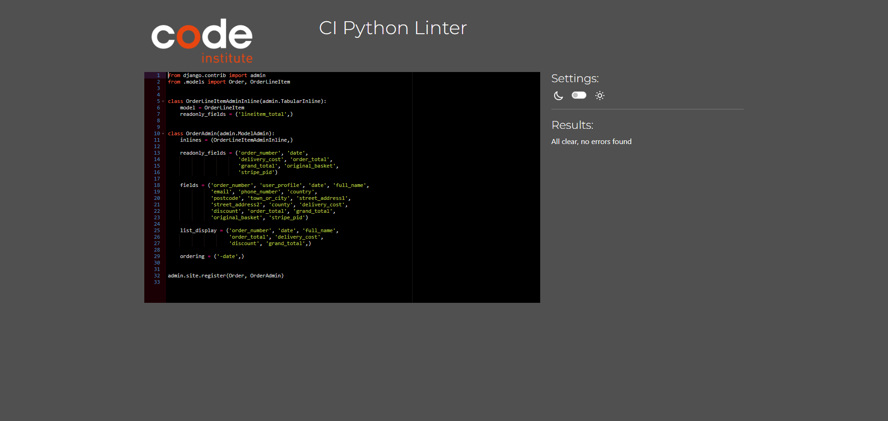

# Testing

Return back to the [README.md](README.md) file.

Throughout the development of this project, I've carried out numerous tests to ensure that the site works well. In this section you will find documentation of all tests carried out throughout the site.

## Code Validation

I have validated all of my code using the recommended tools for each language.

### HTML

I have used the recommended [HTML W3C Validator](https://validator.w3.org) to validate all of my HTML files.

| Page | W3C URL | Screenshot | Notes |
| --- | --- | --- | --- |
| Home | [W3C](https://validator.w3.org/nu/?doc=https%3A%2F%2Fretro-reboot.herokuapp.com%2F) |  | Pass: No Errors |
| All Products | [W3C](https://validator.w3.org/nu/?doc=https%3A%2F%2Fretro-reboot.herokuapp.com%2Fproducts%2F) |  | Pass: No Errors |
| Individual Product | [W3C](https://validator.w3.org/nu/?doc=https%3A%2F%2Fretro-reboot.herokuapp.com%2Fproducts%2F13%2F) |  | Pass: No Errors |
| Contact | [W3C](https://validator.w3.org/nu/?doc=https%3A%2F%2Fretro-reboot.herokuapp.com%2Fcontact%2F) |  | Error: Bad value 100% for attribute width on element iframe (Needed to display map properly) |
| Blog | [W3C](https://validator.w3.org/nu/?doc=https%3A%2F%2Fretro-reboot.herokuapp.com%2Fblog%2F) |  | Pass: No Errors |
| Blog Post | [W3C](https://validator.w3.org/nu/?doc=https%3A%2F%2Fretro-reboot.herokuapp.com%2Fblog%2Fcaring-for-game-cartridges-essential-tips%2F) |  | Pass: No Errors |
| Sign Up | [W3C](https://validator.w3.org/nu/?doc=https%3A%2F%2Fretro-reboot.herokuapp.com%2Faccounts%2Fsignup%2F) |  | Pass: No Errors |
| Sign In | [W3C](https://validator.w3.org/nu/?doc=https%3A%2F%2Fretro-reboot.herokuapp.com%2Faccounts%2Flogin%2F) |  | Pass: No Errors |
| Password Reset | [W3C](https://validator.w3.org/nu/?doc=https%3A%2F%2Fretro-reboot.herokuapp.com%2Faccounts%2Fpassword%2Freset%2F) |  | Pass: No Errors |
| Search | [W3C](https://validator.w3.org/nu/?doc=https%3A%2F%2Fretro-reboot.herokuapp.com%2Fproducts%2F%3Fq%3Dpokemon) |  | Pass: No Errors |
| Log Out | n/a |  | Pass: No Errors |
| Basket | n/a |  | Pass: No Errors |
| Checkout | n/a |  | Warning: Empty heading (Loading spinner after submitting checkout form) |
| Checkout Success | n/a |  | Pass: No Errors |
| Profile | n/a |  | Pass: No Errors |
| Add Product | n/a |  | Pass: No Errors |
| Edit Product | n/a |  | Error: An img element must have an alt attribute, except under certain conditions (Current image for product being edited) |
| Delete Product | n/a |  | Pass: No Errors |
| Add Blog | n/a |  | Multiple Errors all from summernote widget for blog content field |
| Edit Blog | n/a |  | Multiple Errors all from summernote widget for blog content field |
| Delete Blog | n/a |  | Pass: No Errors |
| Open Tickets | n/a |  | Pass: No Errors |

### CSS

I have used the recommended [CSS Jigsaw Validator](https://jigsaw.w3.org/css-validator) to validate all of my CSS files.

| File | Jigsaw URL | Screenshot | Notes |
| --- | --- | --- | --- |
| style.css | [Jigsaw](https://jigsaw.w3.org/css-validator/validator?uri=https%3A%2F%2Fretro-reboot.herokuapp.com%2F&profile=css3svg&usermedium=all&warning=1&vextwarning=&lang=en#warnings) |  | Pass: No Errors |
| checkout.css | n/a |  | Pass: No Errors |
| profile.css | n/a |  | Pass: No Errors |

### JavaScript

I have used the recommended [JShint Validator](https://jshint.com) to validate all of my JS files.

| File | Screenshot | Notes |
| --- | --- | --- |
| konami-code.js |  | Pass: No Errors |
| add_post.html (postloadjs) |  | Pass: No Errors |
| edit_post.html (postloadjs) |  | Pass: No Errors |
| add_product.html (postloadjs) |  | Pass: No Errors |
| edit_product.html (postloadjs) |  | Pass: No Errors |
| products.html (postloadjs) |  | Pass: No Errors |
| basket.html (postloadjs) |  | Pass: No Errors |
| quantity_input_script.html (script) |  | Pass: No Errors |
| stripe_elements.js |  | Undefined Stripe variable |

### Python

I have used the recommended [CI Python Linter](https://pep8ci.herokuapp.com) to validate all of my Python files.

| File | CI URL | Screenshot | Notes |
| --- | --- | --- | --- |
| Basket contexts.py | [CI PEP8](https://pep8ci.herokuapp.com/https://raw.githubusercontent.com/adamgilroy22/retro-reboot/main/basket/contexts.py) |  | Pass: No Errors |
| Basket urls.py | [CI PEP8](https://pep8ci.herokuapp.com/https://raw.githubusercontent.com/adamgilroy22/retro-reboot/main/basket/urls.py) |  | Pass: No Errors |
| Basket views.py | [CI PEP8](https://pep8ci.herokuapp.com/https://raw.githubusercontent.com/adamgilroy22/retro-reboot/main/basket/views.py) |  | Pass: No Errors |
| Blog admin.py | [CI PEP8](https://pep8ci.herokuapp.com/https://raw.githubusercontent.com/adamgilroy22/retro-reboot/main/blog/admin.py) |  | Pass: No Errors |
| Blog forms.py | [CI PEP8](https://pep8ci.herokuapp.com/https://raw.githubusercontent.com/adamgilroy22/retro-reboot/main/blog/forms.py) |  | Pass: No Errors |
| Blog models.py | [CI PEP8](https://pep8ci.herokuapp.com/https://raw.githubusercontent.com/adamgilroy22/retro-reboot/main/blog/models.py) |  | Pass: No Errors |
| Blog urls.py | [CI PEP8](https://pep8ci.herokuapp.com/https://raw.githubusercontent.com/adamgilroy22/retro-reboot/main/blog/urls.py) |  | Pass: No Errors |
| Blog views.py | [CI PEP8](https://pep8ci.herokuapp.com/https://raw.githubusercontent.com/adamgilroy22/retro-reboot/main/blog/views.py) |  | Pass: No Errors |
| Checkout admin.py | [CI PEP8](https://pep8ci.herokuapp.com/https://raw.githubusercontent.com/adamgilroy22/retro-reboot/main/checkout/admin.py) |  | Pass: No Errors |
| Checkout forms.py | [CI PEP8](https://pep8ci.herokuapp.com/https://raw.githubusercontent.com/adamgilroy22/retro-reboot/main/checkout/forms.py) |  | Pass: No Errors |
| Checkout models.py | [CI PEP8](https://pep8ci.herokuapp.com/https://raw.githubusercontent.com/adamgilroy22/retro-reboot/main/checkout/models.py) |  | Pass: No Errors |
| Checkout signals.py | [CI PEP8](https://pep8ci.herokuapp.com/https://raw.githubusercontent.com/adamgilroy22/retro-reboot/main/checkout/signals.py) |  | Pass: No Errors |
| Checkout urls.py | [CI PEP8](https://pep8ci.herokuapp.com/https://raw.githubusercontent.com/adamgilroy22/retro-reboot/main/checkout/urls.py) |  | Pass: No Errors |
| Checkout views.py | [CI PEP8](https://pep8ci.herokuapp.com/https://raw.githubusercontent.com/adamgilroy22/retro-reboot/main/checkout/views.py) |  | Pass: No Errors |
| Checkout webhook_handler.py | [CI PEP8](https://pep8ci.herokuapp.com/https://raw.githubusercontent.com/adamgilroy22/retro-reboot/main/checkout/webhook_handler.py) |  | Pass: No Errors |
| Checkout webhooks.py | [CI PEP8](https://pep8ci.herokuapp.com/https://raw.githubusercontent.com/adamgilroy22/retro-reboot/main/checkout/webhooks.py) |  | Pass: No Errors |
| Contact admin.py | [CI PEP8](https://pep8ci.herokuapp.com/https://raw.githubusercontent.com/adamgilroy22/retro-reboot/main/contact/admin.py) |  | Pass: No Errors |
| Contact forms.py | [CI PEP8](https://pep8ci.herokuapp.com/https://raw.githubusercontent.com/adamgilroy22/retro-reboot/main/contact/forms.py) |  | Pass: No Errors |
| Contact models.py | [CI PEP8](https://pep8ci.herokuapp.com/https://raw.githubusercontent.com/adamgilroy22/retro-reboot/main/contact/models.py) |  | Pass: No Errors |
| Contact urls.py | [CI PEP8](https://pep8ci.herokuapp.com/https://raw.githubusercontent.com/adamgilroy22/retro-reboot/main/contact/urls.py) |  | Pass: No Errors |
| Contact views.py | [CI PEP8](https://pep8ci.herokuapp.com/https://raw.githubusercontent.com/adamgilroy22/retro-reboot/main/contact/views.py) |  | Pass: No Errors |
| Discount Codes admin.py | [CI PEP8](https://pep8ci.herokuapp.com/https://raw.githubusercontent.com/adamgilroy22/retro-reboot/main/discount_codes/admin.py) |  | Pass: No Errors |
| Discount Codes forms.py | [CI PEP8](https://pep8ci.herokuapp.com/https://raw.githubusercontent.com/adamgilroy22/retro-reboot/main/discount_codes/forms.py) |   | Pass: No Errors |
| Discount Codes models.py | [CI PEP8](https://pep8ci.herokuapp.com/https://raw.githubusercontent.com/adamgilroy22/retro-reboot/main/discount_codes/models.py) |   | Pass: No Errors |
| Homepage urls.py | [CI PEP8](https://pep8ci.herokuapp.com/https://raw.githubusercontent.com/adamgilroy22/retro-reboot/main/homepage/urls.py) |   | Pass: No Errors |
| Homepage views.py | [CI PEP8](https://pep8ci.herokuapp.com/https://raw.githubusercontent.com/adamgilroy22/retro-reboot/main/homepage/views.py) |  | Pass: No Errors |
| Newsletter admin.py | [CI PEP8](https://pep8ci.herokuapp.com/https://raw.githubusercontent.com/adamgilroy22/retro-reboot/main/newsletter/admin.py) |  | Pass: No Errors |
| Newsletter forms.py | [CI PEP8](https://pep8ci.herokuapp.com/https://raw.githubusercontent.com/adamgilroy22/retro-reboot/main/newsletter/forms.py) |  | Pass: No Errors |
| Newsletter models.py | [CI PEP8](https://pep8ci.herokuapp.com/https://raw.githubusercontent.com/adamgilroy22/retro-reboot/main/newsletter/models.py) |  | Pass: No Errors |
| Newsletter urls.py | [CI PEP8](https://pep8ci.herokuapp.com/https://raw.githubusercontent.com/adamgilroy22/retro-reboot/main/newsletter/urls.py) |  | Pass: No Errors |
| Newsletter views.py | [CI PEP8](https://pep8ci.herokuapp.com/https://raw.githubusercontent.com/adamgilroy22/retro-reboot/main/newsletter/views.py) |  | Pass: No Errors |
| Products admin.py | [CI PEP8](https://pep8ci.herokuapp.com/https://raw.githubusercontent.com/adamgilroy22/retro-reboot/main/products/admin.py) |  | Pass: No Errors |
| Products forms.py | [CI PEP8](https://pep8ci.herokuapp.com/https://raw.githubusercontent.com/adamgilroy22/retro-reboot/main/products/forms.py) |  | Pass: No Errors |
| Products models.py | [CI PEP8](https://pep8ci.herokuapp.com/https://raw.githubusercontent.com/adamgilroy22/retro-reboot/main/products/models.py) |  | Pass: No Errors |
| Products urls.py | [CI PEP8](https://pep8ci.herokuapp.com/https://raw.githubusercontent.com/adamgilroy22/retro-reboot/main/products/urls.py) |  | Pass: No Errors |
| Products views.py | [CI PEP8](https://pep8ci.herokuapp.com/https://raw.githubusercontent.com/adamgilroy22/retro-reboot/main/products/views.py) |  | Pass: No Errors |
| Products widgets.py | [CI PEP8](https://pep8ci.herokuapp.com/https://raw.githubusercontent.com/adamgilroy22/retro-reboot/main/products/widgets.py) |  | Pass: No Errors |
| Profiles forms.py | [CI PEP8](https://pep8ci.herokuapp.com/https://raw.githubusercontent.com/adamgilroy22/retro-reboot/main/profiles/forms.py) |  | Pass: No Errors |
| Profiles models.py | [CI PEP8](https://pep8ci.herokuapp.com/https://raw.githubusercontent.com/adamgilroy22/retro-reboot/main/profiles/models.py) |  | Pass: No Errors |
| Profiles urls.py | [CI PEP8](https://pep8ci.herokuapp.com/https://raw.githubusercontent.com/adamgilroy22/retro-reboot/main/profiles/urls.py) |  | Pass: No Errors |
| Profiles views.py | [CI PEP8](https://pep8ci.herokuapp.com/https://raw.githubusercontent.com/adamgilroy22/retro-reboot/main/profiles/views.py) |  | Pass: No Errors |
| Project Level settings.py | [CI PEP8](https://pep8ci.herokuapp.com/https://raw.githubusercontent.com/adamgilroy22/retro-reboot/main/retro_reboot/settings.py) |  | Pass: No Errors |
| Project Level urls.py | [CI PEP8](https://pep8ci.herokuapp.com/https://raw.githubusercontent.com/adamgilroy22/retro-reboot/main/retro_reboot/urls.py) |  | Pass: No Errors |
| Project Level views.py | [CI PEP8](https://pep8ci.herokuapp.com/https://raw.githubusercontent.com/adamgilroy22/retro-reboot/main/retro_reboot/views.py) |  | Pass: No Errors |


## Browser Compatibility

I've tested my deployed project on multiple browsers to check for compatibility issues.

| Browser | Screenshot | Notes |
| --- | --- | --- |
| Chrome |  | Works as expected |
| Firefox |  | Works as expected |
| Edge |  | Works as expected |

## Responsiveness

⚠️⚠️⚠️⚠️⚠️ START OF NOTES (to be deleted) ⚠️⚠️⚠️⚠️⚠️

Use this space to discuss testing the live/deployed site on various device sizes.

The minimum requirement is for the following 3 tests:
- Mobile
- Tablet
- Desktop

**IMPORTANT**: You must provide screenshots of the tested responsiveness, to "prove" that you've actually tested them.

Using the "amiresponsive" mockup image (or similar) does not suffice the requirements.
Consider using some of the built-in device sizes in the Developer Tools.

If you have tested the project on your actual mobile phone or tablet, consider also including screenshots of these as well.
It showcases a higher level of manual tests, and can be seen as a positive inclusion!

Sample responsiveness testing documentation:

🛑🛑🛑🛑🛑 END OF NOTES (to be deleted) 🛑🛑🛑🛑🛑

I've tested my deployed project on multiple devices to check for responsiveness issues.

| Device | Screenshot | Notes |
| --- | --- | --- |
| Mobile (DevTools) |  | Works as expected |
| Tablet (DevTools) |  | Works as expected |
| Desktop |  | Works as expected |
| XL Monitor |  | Scaling starts to have minor issues |
| 4K Monitor |  | Noticeable scaling issues |
| Google Pixel 7 Pro |  | Works as expected |
| iPhone 14 |  | Works as expected |
| x | x | repeat for any other tested sizes |

## Lighthouse Audit

I've tested my deployed project using the Lighthouse Audit tool to check for any major issues.

| Page | Size | Screenshot | Notes |
| --- | --- | --- | --- |
| Home | Desktop |  | No major warnings |
| Home | Mobile |  | Some minor warnings |
| All Products | Desktop |  | Some minor warnings |
| All Products | Mobile |  | Some minor warnings |
| Individual Product | Desktop |  | No major warnings |
| Individual Product | Mobile |  | Some minor warnings |
| Contact | Desktop |  | No major warnings |
| Contact | Mobile |  | Some minor warnings |
| Blog | Desktop |  | No major warnings |
| Blog | Mobile |  | Some minor warnings |
| Blog Post | Desktop |  | No major warnings |
| Blog Post | Mobile |  | Some minor warnings |
| Sign Up | Desktop |  | No major warnings |
| Sign Up | Mobile |  | Some minor warnings |
| Sign In | Desktop |  | No major warnings |
| Sign In | Mobile |  | Some minor warnings |
| Password Reset | Desktop |  | No major warnings |
| Password Reset | Mobile |  | Some minor warnings |
| Search | Desktop |  | No major warnings |
| Search | Mobile |  | Some minor warnings |
| Log Out | Desktop |  | No major warnings |
| Log Out | Mobile |  | Some minor warnings |
| Basket | Desktop |  | No major warnings |
| Basket | Mobile |  | Some minor warnings |
| Checkout | Desktop |  | No major warnings |
| Checkout | Mobile |  | Some minor warnings |
| Checkout Success | Desktop |  | Some minor warnings |
| Checkout Success | Mobile |  | Some minor warnings |
| Profile | Desktop |  | No major warnings |
| Profile | Mobile |  | Some minor warnings |

## Defensive Programming

⚠️⚠️⚠️⚠️⚠️ START OF NOTES (to be deleted) ⚠️⚠️⚠️⚠️⚠️

Defensive programming (defensive design) is extremely important!

When building projects that accept user inputs or forms, you should always test the level of security for each.
Examples of this could include (not limited to):

Forms:
- Users cannot submit an empty form
- Users must enter valid email addresses

PP3 (Python-only):
- Users must enter a valid letter/word/string when prompted
- Users must choose from a specific list only

Flask/Django:
- Users cannot brute-force a URL to navigate to a restricted page
- Users cannot perform CRUD functionality while logged-out
- User-A should not be able to manipulate data belonging to User-B, or vice versa
- Non-Authenticated users should not be able to access pages that require authentication
- Standard users should not be able to access pages intended for superusers

You'll want to test all functionality on your application, whether it's a standard form,
or uses CRUD functionality for data manipulation on a database.
Make sure to include the `required` attribute on any form-fields that should be mandatory.
Try to access various pages on your site as different user types (User-A, User-B, guest user, admin, superuser).

You should include any manual tests performed, and the expected results/outcome.

🛑🛑🛑🛑🛑 END OF NOTES (to be deleted) 🛑🛑🛑🛑🛑

Defensive programming was manually tested with the below user acceptance testing:

| Page | User Action | Expected Result | Pass/Fail | Comments |
| --- | --- | --- | --- | --- |
| Home Page | | | | |
| | Click on Logo | Redirection to Home page | Pass | |
| | Click on Home link in navbar | Redirection to Home page | Pass | |
| Gallery Page | | | | |
| | Click on Gallery link in navbar | Redirection to Gallery page | Pass | |
| | Load gallery images | All images load as expected | Pass | |
| Contact Page | | | | |
| | Click on Contact link in navbar | Redirection to Contact page | Pass | |
| | Enter first/last name | Field will accept freeform text | Pass | |
| | Enter valid email address | Field will only accept email address format | Pass | |
| | Enter message in textarea | Field will accept freeform text | Pass | |
| | Click the Submit button | Redirects user to form-dump | Pass | User must click 'Back' button to return |
| Sign Up | | | | |
| | Click on Sign Up button | Redirection to Sign Up page | Pass | |
| | Enter valid email address | Field will only accept email address format | Pass | |
| | Enter valid password (twice) | Field will only accept password format | Pass | |
| | Click on Sign Up button | Asks user to confirm email page | Pass | Email sent to user |
| | Confirm email | Redirects user to blank Sign In page | Pass | |
| Log In | | | | |
| | Click on the Login link | Redirection to Login page | Pass | |
| | Enter valid email address | Field will only accept email address format | Pass | |
| | Enter valid password | Field will only accept password format | Pass | |
| | Click Login button | Redirects user to home page | Pass | |
| Log Out | | | | |
| | Click Logout button | Redirects user to logout page | Pass | Confirms logout first |
| | Click Confirm Logout button | Redirects user to home page | Pass | |
| Profile | | | | |
| | Click on Profile button | User will be redirected to the Profile page | Pass | |
| | Click on the Edit button | User will be redirected to the edit profile page | Pass | |
| | Click on the My Orders link | User will be redirected to the My Orders page | Pass | |
| | Brute forcing the URL to get to another user's profile | User should be given an error | Pass | Redirects user back to own profile |

⚠️⚠️⚠️⚠️⚠️ START OF NOTES (to be deleted) ⚠️⚠️⚠️⚠️⚠️

Repeat for all other tests, as applicable to your own site.
The aforementioned tests are just an example of a few different project scenarios.

🛑🛑🛑🛑🛑 END OF NOTES (to be deleted) 🛑🛑🛑🛑🛑

## User Story Testing

The following are user stories I've implemented with screenshots to prove.

| User Story | Screenshot |
| --- | --- |
| As a first-time site visitor I want to be able to clearly see what the site's purpose is so that I can decide whether or not to continue browsing it. |  |
| As a user I want to be able to easily navigate the website so that I can find the content I'm looking for. |  |
| As a site user I want to be able to search the website so that I can find specific products and see if the site has them in stock. |  |
| As a site user I want to be able to contact the site owners so that I can request further information about the site or lodge a complaint. |  |
| As a site user I want to be able to see a list of all site products so that I can browse what the site has to offer. |  |
| As a site user I want to be able to see the prices of products clearly so that I can make a decision whether or not to purchase. |  |
| As a site user I want to be able to view a product on its own individual page so that I can see more information about the product. |  |
| As a site user I want to be able to sort products by category (game/console or games by console) so that I can find specific products related to the category I select. |  |
| As a site user I want to be able to add products to my shopping basket so that I can proceed to the checkout and purchase them. |  |
| As a site user I want to be able to see a running total of the items in my basket so that I can manage my spending and know what to expect at the checkout. |  |
| As a site user I want to be able to checkout with a card payment so that I can place an order for the items in my basket. |  |
| As a site user I want to be able to receive an order confirmation email after I purchase from the shop so that I can have a record of what I've purchased in my email inbox. |  |
| As a site user I want to be able to apply discount codes in the checkout so that I can receive a discount on my purchase. |  |
| As a site user I want to be able to create an account on the site so that I can save my billing and shipping details and see a history of my purchases on my account. |  |
| As a registered user I want to be able to edit the details saved to my account so that I can keep my details up to date. |  |
| As a site user I want to be able to view blog posts on the website so that I can read any posts I feel are relevant to me. |  |
| As a site admin I want to be able to create blog posts from the front end so that I can share information with site visitors. |  |
| As a site admin I want to be able to edit existing blog posts so that I can ensure that posts are up to date and relevant without having to create them from scratch in case of error. |  |
| As a site admin I want to be able to delete existing blog posts so that I can remove any unwanted posts from the site. |  |
| As a site admin I want to be able to create new products from the front end so that I can easily add new products to the site. |  |
| As a site admin I want to be able to edit existing products so that I can ensure that all product listings are up to date and accurate. |  |
| As a site admin I want to be able to delete products from the site so that I can remove any products that are no longer being supplied by the site. |  |
| As a site admin I want to be able to set the stock for each product so that I can manage how many units of each product the site can sell. |  |
| As a site admin I want to be able to see a list of open tickets so that I can manage contact form inquiries. |  |
| As a site user I want to be able to sign up for the site's mailing list so that I can receive offers and news in my inbox. |  |
| As a site user I want to be able to enter the Konami code (Up Up Down Down Left Right Left Right B A) on my keyboard so that I can experience an easter egg. |  |
| As a site admin I want to be able to set appropriate keywords on site pages so that I can increase the chances potential customers will find the site when searching to purchase records on Google. |  |
| As a site admin I want to be able to share the business on Facebook so that I can reach and market to a larger audience. |  |

The following are user stories I wasn't able to implement and have labeled as Wont Have in my MoSCoW prioritization

| User Story | Screenshot |
| --- | --- |
| As a registered site user I want to be able to review products that I have purchased so that I can share my experience with other potential customers. | N/A |
| As a registered site user I want to be able to add products to a wish list so that I can keep a collection of items I am interested in buying in the future. | N/A |
| As a site user I want to be able to spin a discount wheel so that I can receive a discount code pending on the outcome of the wheel. | N/A |
| As a site admin I want to be able to send marketing emails to people who signed up to the mailing list so that I can send out updates and offers to their inboxes. | N/A |

## Automated Testing

I have conducted a series of automated tests on my application.

I fully acknowledge and understand that, in a real-world scenario, an extensive set of additional tests would be more comprehensive.

### JavaScript (Jest Testing)

⚠️⚠️⚠️⚠️⚠️ START OF NOTES (to be deleted) ⚠️⚠️⚠️⚠️⚠️

Adjust the code below (file names, etc.) to match your own project files/folders.

🛑🛑🛑🛑🛑 END OF NOTES (to be deleted) 🛑🛑🛑🛑🛑

I have used the [Jest](https://jestjs.io) JavaScript testing framework to test the application functionality.

In order to work with Jest, I first had to initialize NPM.

- `npm init`
- Hit `enter` for all options, except for **test command:**, just type `jest`.

Add Jest to a list called **Dev Dependencies** in a dev environment:

- `npm install --save-dev jest`

**IMPORTANT**: Initial configurations

When creating test files, the name of the file needs to be `file-name.test.js` in order for Jest to properly work.

Due to a change in Jest's default configuration, you'll need to add the following code to the top of the `.test.js` file:

```js
/**
 * @jest-environment jsdom
 */

const { test, expect } = require("@jest/globals");
const { function1, function2, function3, etc. } = require("../script-name");

beforeAll(() => {
    let fs = require("fs");
    let fileContents = fs.readFileSync("index.html", "utf-8");
    document.open();
    document.write(fileContents);
    document.close();
});
```

Remember to adjust the `fs.readFileSync()` to the specific file you'd like you test.
The example above is testing the `index.html` file.

Finally, at the bottom of the script file where your primary scripts are written, include the following at the bottom of the file.
Make sure to include the name of all of your functions that are being tested in the `.test.js` file.

```js
if (typeof module !== "undefined") module.exports = {
    function1, function2, function3, etc.
};
```

Now that these steps have been undertaken, further tests can be written, and be expected to fail initially.
Write JS code that can get the tests to pass as part of the Red-Green refactor process.

Once ready, to run the tests, use this command:

- `npm test`

**NOTE**: To obtain a coverage report, use the following command:

- `npm test --coverage`

Below are the results from the tests that I've written for this application:

| Test Suites | Tests | Coverage | Screenshot |
| --- | --- | --- | --- |
| 1 passed | 16 passed | 55% |  |
| x | x | x | repeat for all remaining tests |

#### Jest Test Issues

⚠️⚠️⚠️⚠️⚠️ START OF NOTES (to be deleted) ⚠️⚠️⚠️⚠️⚠️

Use this section to list any known issues you ran into while writing your Jest tests.
Remember to include screenshots (where possible), and a solution to the issue (if known).

This can be used for both "fixed" and "unresolved" issues.

🛑🛑🛑🛑🛑 END OF NOTES (to be deleted) 🛑🛑🛑🛑🛑

### Python (Unit Testing)

⚠️⚠️⚠️⚠️⚠️ START OF NOTES (to be deleted) ⚠️⚠️⚠️⚠️⚠️

Adjust the code below (file names, etc.) to match your own project files/folders.

🛑🛑🛑🛑🛑 END OF NOTES (to be deleted) 🛑🛑🛑🛑🛑

I have used Django's built-in unit testing framework to test the application functionality.

In order to run the tests, I ran the following command in the terminal each time:

`python3 manage.py test name-of-app `

To create the coverage report, I would then run the following commands:

`coverage run --source=name-of-app manage.py test`

`coverage report`

To see the HTML version of the reports, and find out whether some pieces of code were missing, I ran the following commands:

`coverage html`

`python3 -m http.server`

Below are the results from the various apps on my application that I've tested:

| App | File | Coverage | Screenshot |
| --- | --- | --- | --- |
| Bag | test_forms.py | 99% |  |
| Bag | test_models.py | 89% |  |
| Bag | test_urls.py | 100% |  |
| Bag | test_views.py | 71% |  |
| Checkout | test_forms.py | 99% |  |
| Checkout | test_models.py | 89% |  |
| Checkout | test_urls.py | 100% |  |
| Checkout | test_views.py | 71% |  |
| Home | test_forms.py | 99% |  |
| Home | test_models.py | 89% |  |
| Home | test_urls.py | 100% |  |
| Home | test_views.py | 71% |  |
| Products | test_forms.py | 99% |  |
| Products | test_models.py | 89% |  |
| Products | test_urls.py | 100% |  |
| Products | test_views.py | 71% |  |
| Profiles | test_forms.py | 99% |  |
| Profiles | test_models.py | 89% |  |
| Profiles | test_urls.py | 100% |  |
| Profiles | test_views.py | 71% |  |
| x | x | x | repeat for all remaining tested apps/files |

#### Unit Test Issues

⚠️⚠️⚠️⚠️⚠️ START OF NOTES (to be deleted) ⚠️⚠️⚠️⚠️⚠️

Use this section to list any known issues you ran into while writing your unit tests.
Remember to include screenshots (where possible), and a solution to the issue (if known).

This can be used for both "fixed" and "unresolved" issues.

🛑🛑🛑🛑🛑 END OF NOTES (to be deleted) 🛑🛑🛑🛑🛑

## Bugs

⚠️⚠️⚠️⚠️⚠️ START OF NOTES (to be deleted) ⚠️⚠️⚠️⚠️⚠️

It's very important to document any bugs you've discovered while developing the project.
Make sure to include any necessary steps you've implemented to fix the bug(s) as well.

For JavaScript and Python applications, it's best to screenshot the errors to include them as well.

**PRO TIP**: screenshots of bugs are extremely helpful, and go a long way!

🛑🛑🛑🛑🛑 END OF NOTES (to be deleted) 🛑🛑🛑🛑🛑

- JS Uncaught ReferenceError: `foobar` is undefined/not defined

    

    - To fix this, I _____________________.

- JS `'let'` or `'const'` or `'template literal syntax'` or `'arrow function syntax (=>)'` is available in ES6 (use `'esversion: 11'`) or Mozilla JS extensions (use moz).

    

    - To fix this, I _____________________.

- Python `'ModuleNotFoundError'` when trying to import module from imported package

    

    - To fix this, I _____________________.

- Django `TemplateDoesNotExist` at /appname/path appname/template_name.html

    

    - To fix this, I _____________________.

- Python `E501 line too long` (93 > 79 characters)

    

    - To fix this, I _____________________.

### GitHub **Issues**

⚠️⚠️⚠️⚠️⚠️ START OF NOTES (to be deleted) ⚠️⚠️⚠️⚠️⚠️

An improved way to manage bugs is to use the built-in **Issues** tracker on your GitHub repository.
To access your Issues, click on the "Issues" tab at the top of your repository.
Alternatively, use this link: https://github.com/adamgilroy22/retro-reboot/issues

If using the Issues tracker for your bug management, you can simplify the documentation process.
Issues allow you to directly paste screenshots into the issue without having to first save the screenshot locally,
then uploading into your project.

You can add labels to your issues (`bug`), assign yourself as the owner, and add comments/updates as you progress with fixing the issue(s).

Once you've sorted the issue, you should then "Close" it.

When showcasing your bug tracking for assessment, you can use the following format:

🛑🛑🛑🛑🛑 END OF NOTES (to be deleted) 🛑🛑🛑🛑🛑

**Fixed Bugs**

All previously closed/fixed bugs can be tracked [here](https://github.com/adamgilroy22/retro-reboot/issues?q=is%3Aissue+is%3Aclosed).

| Bug | Status |
| --- | --- |
| [JS Uncaught ReferenceError: `foobar` is undefined/not defined](https://github.com/adamgilroy22/retro-reboot/issues/1) | Closed |
| [Python `'ModuleNotFoundError'` when trying to import module from imported package](https://github.com/adamgilroy22/retro-reboot/issues/2) | Closed |
| [Django `TemplateDoesNotExist` at /appname/path appname/template_name.html](https://github.com/adamgilroy22/retro-reboot/issues/3) | Closed |

**Open Issues**

Any remaining open issues can be tracked [here](https://github.com/adamgilroy22/retro-reboot/issues).

| Bug | Status |
| --- | --- |
| [JS `'let'` or `'const'` or `'template literal syntax'` or `'arrow function syntax (=>)'` is available in ES6 (use `'esversion: 11'`) or Mozilla JS extensions (use moz).](https://github.com/adamgilroy22/retro-reboot/issues/4) | Open |
| [Python `E501 line too long` (93 > 79 characters)](https://github.com/adamgilroy22/retro-reboot/issues/5) | Open |

## Unfixed Bugs

⚠️⚠️⚠️⚠️⚠️ START OF NOTES (to be deleted) ⚠️⚠️⚠️⚠️⚠️

You will need to mention unfixed bugs and why they were not fixed.
This section should include shortcomings of the frameworks or technologies used.
Although time can be a big variable to consider, paucity of time and difficulty understanding
implementation is not a valid reason to leave bugs unfixed.

If you've identified any unfixed bugs, no matter how small, be sure to list them here.
It's better to be honest and list them, because if it's not documented and an assessor finds the issue,
they need to know whether or not you're aware of them as well, and why you've not corrected/fixed them.

Some examples:

🛑🛑🛑🛑🛑 END OF NOTES (to be deleted) 🛑🛑🛑🛑🛑

- On devices smaller than 375px, the page starts to have `overflow-x` scrolling.

    

    - Attempted fix: I tried to add additional media queries to handle this, but things started becoming too small to read.

- For PP3, when using a helper `clear()` function, any text above the height of the terminal does not clear, and remains when you scroll up.

    

    - Attempted fix: I tried to adjust the terminal size, but it only resizes the actual terminal, not the allowable area for text.

- When validating HTML with a semantic `section` element, the validator warns about lacking a header `h2-h6`. This is acceptable.

    

    - Attempted fix: this is a known warning and acceptable, and my section doesn't require a header since it's dynamically added via JS.

⚠️⚠️⚠️⚠️⚠️ START OF NOTES (to be deleted) ⚠️⚠️⚠️⚠️⚠️

If you legitimately cannot find any unfixed bugs or warnings, then use the following sentence:

🛑🛑🛑🛑🛑 END OF NOTES (to be deleted) 🛑🛑🛑🛑🛑

There are no remaining bugs that I am aware of.