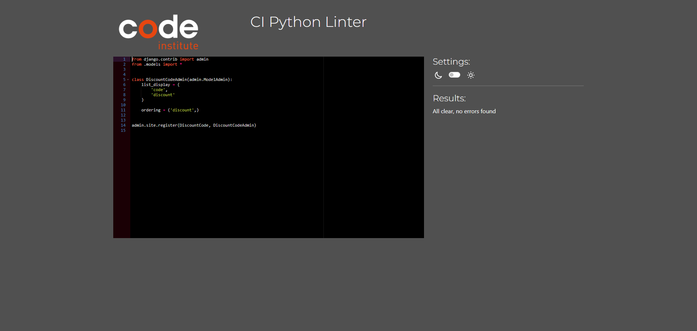
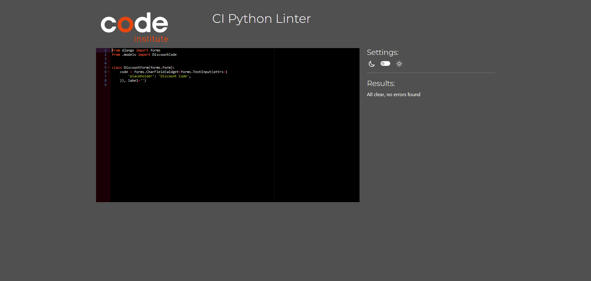
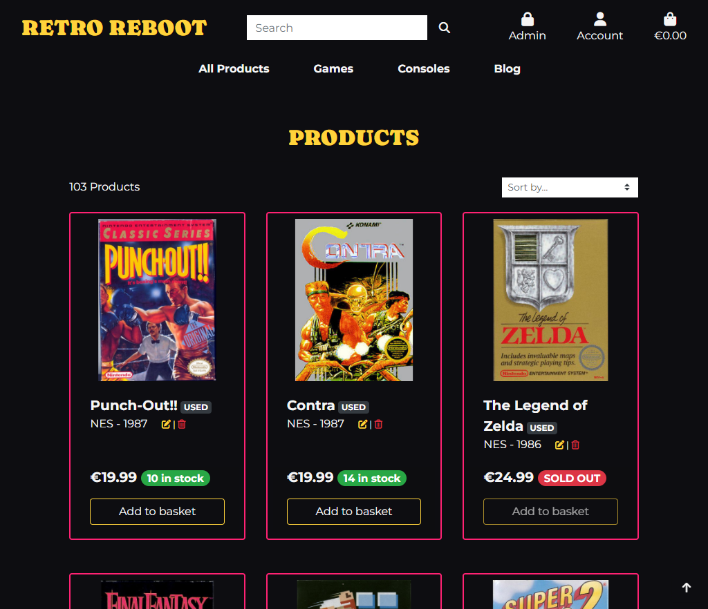
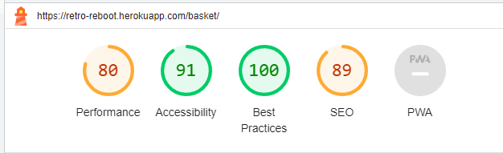
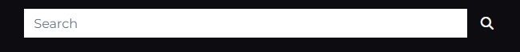
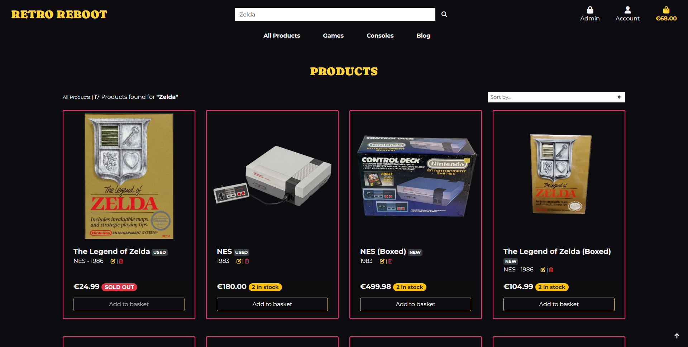
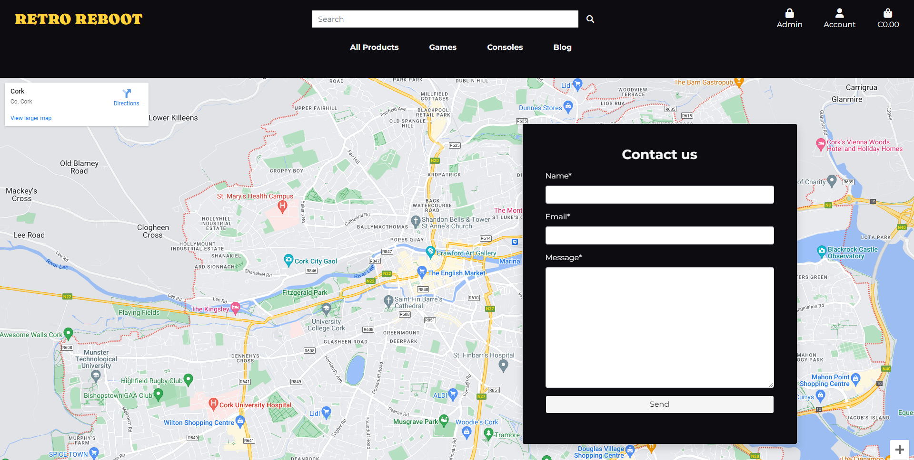
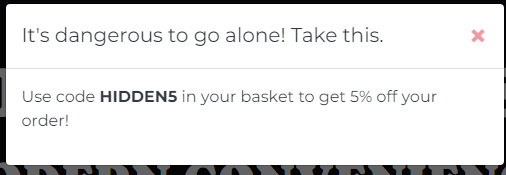

# Testing

Return back to the [README.md](README.md) file.

Throughout the development of this project, I've carried out numerous tests to ensure that the site works well. In this section you will find documentation of all tests carried out throughout the site.

## Code Validation

I have validated all of my code using the recommended tools for each language.

### HTML

I have used the recommended [HTML W3C Validator](https://validator.w3.org) to validate all of my HTML files.

| Page | W3C URL | Screenshot | Notes |
| --- | --- | --- | --- |
| Home | [W3C](https://validator.w3.org/nu/?doc=https%3A%2F%2Fretro-reboot.herokuapp.com%2F) |  | Pass: No Errors |
| All Products | [W3C](https://validator.w3.org/nu/?doc=https%3A%2F%2Fretro-reboot.herokuapp.com%2Fproducts%2F) |  | Pass: No Errors |
| Individual Product | [W3C](https://validator.w3.org/nu/?doc=https%3A%2F%2Fretro-reboot.herokuapp.com%2Fproducts%2F13%2F) |  | Pass: No Errors |
| Contact | [W3C](https://validator.w3.org/nu/?doc=https%3A%2F%2Fretro-reboot.herokuapp.com%2Fcontact%2F) |  | Error: Bad value 100% for attribute width on element iframe (Needed to display map properly) |
| Blog | [W3C](https://validator.w3.org/nu/?doc=https%3A%2F%2Fretro-reboot.herokuapp.com%2Fblog%2F) |  | Pass: No Errors |
| Blog Post | [W3C](https://validator.w3.org/nu/?doc=https%3A%2F%2Fretro-reboot.herokuapp.com%2Fblog%2Fcaring-for-game-cartridges-essential-tips%2F) |  | Pass: No Errors |
| Sign Up | [W3C](https://validator.w3.org/nu/?doc=https%3A%2F%2Fretro-reboot.herokuapp.com%2Faccounts%2Fsignup%2F) |  | Pass: No Errors |
| Sign In | [W3C](https://validator.w3.org/nu/?doc=https%3A%2F%2Fretro-reboot.herokuapp.com%2Faccounts%2Flogin%2F) |  | Pass: No Errors |
| Password Reset | [W3C](https://validator.w3.org/nu/?doc=https%3A%2F%2Fretro-reboot.herokuapp.com%2Faccounts%2Fpassword%2Freset%2F) |  | Pass: No Errors |
| Search | [W3C](https://validator.w3.org/nu/?doc=https%3A%2F%2Fretro-reboot.herokuapp.com%2Fproducts%2F%3Fq%3Dpokemon) |  | Pass: No Errors |
| Log Out | n/a |  | Pass: No Errors |
| Basket | n/a |  | Pass: No Errors |
| Checkout | n/a |  | Warning: Empty heading (Loading spinner after submitting checkout form) |
| Checkout Success | n/a |  | Pass: No Errors |
| Profile | n/a |  | Pass: No Errors |
| Add Product | n/a |  | Pass: No Errors |
| Edit Product | n/a |  | Error: An img element must have an alt attribute, except under certain conditions (Current image for product being edited) |
| Delete Product | n/a |  | Pass: No Errors |
| Add Blog | n/a |  | Multiple Errors all from summernote widget for blog content field |
| Edit Blog | n/a |  | Multiple Errors all from summernote widget for blog content field |
| Delete Blog | n/a |  | Pass: No Errors |
| Open Tickets | n/a |  | Pass: No Errors |

### CSS

I have used the recommended [CSS Jigsaw Validator](https://jigsaw.w3.org/css-validator) to validate all of my CSS files.

| File | Jigsaw URL | Screenshot | Notes |
| --- | --- | --- | --- |
| style.css | [Jigsaw](https://jigsaw.w3.org/css-validator/validator?uri=https%3A%2F%2Fretro-reboot.herokuapp.com%2F&profile=css3svg&usermedium=all&warning=1&vextwarning=&lang=en#warnings) |  | Pass: No Errors |
| checkout.css | n/a |  | Pass: No Errors |
| profile.css | n/a |  | Pass: No Errors |

### JavaScript

I have used the recommended [JShint Validator](https://jshint.com) to validate all of my JS files.

| File | Screenshot | Notes |
| --- | --- | --- |
| konami-code.js |  | Pass: No Errors |
| add_post.html (postloadjs) |  | Pass: No Errors |
| edit_post.html (postloadjs) |  | Pass: No Errors |
| add_product.html (postloadjs) |  | Pass: No Errors |
| edit_product.html (postloadjs) |  | Pass: No Errors |
| products.html (postloadjs) |  | Pass: No Errors |
| basket.html (postloadjs) |  | Pass: No Errors |
| quantity_input_script.html (script) |  | Pass: No Errors |
| stripe_elements.js |  | Undefined Stripe variable |

### Python

I have used the recommended [CI Python Linter](https://pep8ci.herokuapp.com) to validate all of my Python files.

| File | CI URL | Screenshot | Notes |
| --- | --- | --- | --- |
| Basket contexts.py | [CI PEP8](https://pep8ci.herokuapp.com/https://raw.githubusercontent.com/adamgilroy22/retro-reboot/main/basket/contexts.py) |  | Pass: No Errors |
| Basket urls.py | [CI PEP8](https://pep8ci.herokuapp.com/https://raw.githubusercontent.com/adamgilroy22/retro-reboot/main/basket/urls.py) |  | Pass: No Errors |
| Basket views.py | [CI PEP8](https://pep8ci.herokuapp.com/https://raw.githubusercontent.com/adamgilroy22/retro-reboot/main/basket/views.py) |  | Pass: No Errors |
| Blog admin.py | [CI PEP8](https://pep8ci.herokuapp.com/https://raw.githubusercontent.com/adamgilroy22/retro-reboot/main/blog/admin.py) |  | Pass: No Errors |
| Blog forms.py | [CI PEP8](https://pep8ci.herokuapp.com/https://raw.githubusercontent.com/adamgilroy22/retro-reboot/main/blog/forms.py) |  | Pass: No Errors |
| Blog models.py | [CI PEP8](https://pep8ci.herokuapp.com/https://raw.githubusercontent.com/adamgilroy22/retro-reboot/main/blog/models.py) |  | Pass: No Errors |
| Blog urls.py | [CI PEP8](https://pep8ci.herokuapp.com/https://raw.githubusercontent.com/adamgilroy22/retro-reboot/main/blog/urls.py) |  | Pass: No Errors |
| Blog views.py | [CI PEP8](https://pep8ci.herokuapp.com/https://raw.githubusercontent.com/adamgilroy22/retro-reboot/main/blog/views.py) |  | Pass: No Errors |
| Checkout admin.py | [CI PEP8](https://pep8ci.herokuapp.com/https://raw.githubusercontent.com/adamgilroy22/retro-reboot/main/checkout/admin.py) |  | Pass: No Errors |
| Checkout forms.py | [CI PEP8](https://pep8ci.herokuapp.com/https://raw.githubusercontent.com/adamgilroy22/retro-reboot/main/checkout/forms.py) |  | Pass: No Errors |
| Checkout models.py | [CI PEP8](https://pep8ci.herokuapp.com/https://raw.githubusercontent.com/adamgilroy22/retro-reboot/main/checkout/models.py) |  | Pass: No Errors |
| Checkout signals.py | [CI PEP8](https://pep8ci.herokuapp.com/https://raw.githubusercontent.com/adamgilroy22/retro-reboot/main/checkout/signals.py) |  | Pass: No Errors |
| Checkout urls.py | [CI PEP8](https://pep8ci.herokuapp.com/https://raw.githubusercontent.com/adamgilroy22/retro-reboot/main/checkout/urls.py) |  | Pass: No Errors |
| Checkout views.py | [CI PEP8](https://pep8ci.herokuapp.com/https://raw.githubusercontent.com/adamgilroy22/retro-reboot/main/checkout/views.py) |  | Pass: No Errors |
| Checkout webhook_handler.py | [CI PEP8](https://pep8ci.herokuapp.com/https://raw.githubusercontent.com/adamgilroy22/retro-reboot/main/checkout/webhook_handler.py) |  | Pass: No Errors |
| Checkout webhooks.py | [CI PEP8](https://pep8ci.herokuapp.com/https://raw.githubusercontent.com/adamgilroy22/retro-reboot/main/checkout/webhooks.py) |  | Pass: No Errors |
| Contact admin.py | [CI PEP8](https://pep8ci.herokuapp.com/https://raw.githubusercontent.com/adamgilroy22/retro-reboot/main/contact/admin.py) |  | Pass: No Errors |
| Contact forms.py | [CI PEP8](https://pep8ci.herokuapp.com/https://raw.githubusercontent.com/adamgilroy22/retro-reboot/main/contact/forms.py) |  | Pass: No Errors |
| Contact models.py | [CI PEP8](https://pep8ci.herokuapp.com/https://raw.githubusercontent.com/adamgilroy22/retro-reboot/main/contact/models.py) |  | Pass: No Errors |
| Contact urls.py | [CI PEP8](https://pep8ci.herokuapp.com/https://raw.githubusercontent.com/adamgilroy22/retro-reboot/main/contact/urls.py) |  | Pass: No Errors |
| Contact views.py | [CI PEP8](https://pep8ci.herokuapp.com/https://raw.githubusercontent.com/adamgilroy22/retro-reboot/main/contact/views.py) |  | Pass: No Errors |
| Discount Codes admin.py | [CI PEP8](https://pep8ci.herokuapp.com/https://raw.githubusercontent.com/adamgilroy22/retro-reboot/main/discount_codes/admin.py) |  | Pass: No Errors |
| Discount Codes forms.py | [CI PEP8](https://pep8ci.herokuapp.com/https://raw.githubusercontent.com/adamgilroy22/retro-reboot/main/discount_codes/forms.py) |   | Pass: No Errors |
| Discount Codes models.py | [CI PEP8](https://pep8ci.herokuapp.com/https://raw.githubusercontent.com/adamgilroy22/retro-reboot/main/discount_codes/models.py) |   | Pass: No Errors |
| Homepage urls.py | [CI PEP8](https://pep8ci.herokuapp.com/https://raw.githubusercontent.com/adamgilroy22/retro-reboot/main/homepage/urls.py) |   | Pass: No Errors |
| Homepage views.py | [CI PEP8](https://pep8ci.herokuapp.com/https://raw.githubusercontent.com/adamgilroy22/retro-reboot/main/homepage/views.py) |  | Pass: No Errors |
| Newsletter admin.py | [CI PEP8](https://pep8ci.herokuapp.com/https://raw.githubusercontent.com/adamgilroy22/retro-reboot/main/newsletter/admin.py) |  | Pass: No Errors |
| Newsletter forms.py | [CI PEP8](https://pep8ci.herokuapp.com/https://raw.githubusercontent.com/adamgilroy22/retro-reboot/main/newsletter/forms.py) |  | Pass: No Errors |
| Newsletter models.py | [CI PEP8](https://pep8ci.herokuapp.com/https://raw.githubusercontent.com/adamgilroy22/retro-reboot/main/newsletter/models.py) |  | Pass: No Errors |
| Newsletter urls.py | [CI PEP8](https://pep8ci.herokuapp.com/https://raw.githubusercontent.com/adamgilroy22/retro-reboot/main/newsletter/urls.py) |  | Pass: No Errors |
| Newsletter views.py | [CI PEP8](https://pep8ci.herokuapp.com/https://raw.githubusercontent.com/adamgilroy22/retro-reboot/main/newsletter/views.py) |  | Pass: No Errors |
| Products admin.py | [CI PEP8](https://pep8ci.herokuapp.com/https://raw.githubusercontent.com/adamgilroy22/retro-reboot/main/products/admin.py) |  | Pass: No Errors |
| Products forms.py | [CI PEP8](https://pep8ci.herokuapp.com/https://raw.githubusercontent.com/adamgilroy22/retro-reboot/main/products/forms.py) |  | Pass: No Errors |
| Products models.py | [CI PEP8](https://pep8ci.herokuapp.com/https://raw.githubusercontent.com/adamgilroy22/retro-reboot/main/products/models.py) |  | Pass: No Errors |
| Products urls.py | [CI PEP8](https://pep8ci.herokuapp.com/https://raw.githubusercontent.com/adamgilroy22/retro-reboot/main/products/urls.py) |  | Pass: No Errors |
| Products views.py | [CI PEP8](https://pep8ci.herokuapp.com/https://raw.githubusercontent.com/adamgilroy22/retro-reboot/main/products/views.py) |  | Pass: No Errors |
| Products widgets.py | [CI PEP8](https://pep8ci.herokuapp.com/https://raw.githubusercontent.com/adamgilroy22/retro-reboot/main/products/widgets.py) |  | Pass: No Errors |
| Profiles forms.py | [CI PEP8](https://pep8ci.herokuapp.com/https://raw.githubusercontent.com/adamgilroy22/retro-reboot/main/profiles/forms.py) |  | Pass: No Errors |
| Profiles models.py | [CI PEP8](https://pep8ci.herokuapp.com/https://raw.githubusercontent.com/adamgilroy22/retro-reboot/main/profiles/models.py) |  | Pass: No Errors |
| Profiles urls.py | [CI PEP8](https://pep8ci.herokuapp.com/https://raw.githubusercontent.com/adamgilroy22/retro-reboot/main/profiles/urls.py) |  | Pass: No Errors |
| Profiles views.py | [CI PEP8](https://pep8ci.herokuapp.com/https://raw.githubusercontent.com/adamgilroy22/retro-reboot/main/profiles/views.py) |  | Pass: No Errors |
| Project Level settings.py | [CI PEP8](https://pep8ci.herokuapp.com/https://raw.githubusercontent.com/adamgilroy22/retro-reboot/main/retro_reboot/settings.py) |  | Pass: No Errors |
| Project Level urls.py | [CI PEP8](https://pep8ci.herokuapp.com/https://raw.githubusercontent.com/adamgilroy22/retro-reboot/main/retro_reboot/urls.py) |  | Pass: No Errors |
| Project Level views.py | [CI PEP8](https://pep8ci.herokuapp.com/https://raw.githubusercontent.com/adamgilroy22/retro-reboot/main/retro_reboot/views.py) |  | Pass: No Errors |


## Browser Compatibility

I've tested my deployed project on multiple browsers to check for compatibility issues.

| Browser | Screenshot | Notes |
| --- | --- | --- |
| Chrome |  | Works as expected |
| Firefox |  | Works as expected |
| Edge |  | Works as expected |

## Responsiveness

I've tested my deployed project on multiple devices to check for responsiveness issues.

| Device | Screenshot | Notes |
| --- | --- | --- |
| Mobile (DevTools) |    | Works as expected |
| Tablet (DevTools) |    | Works as expected |
| Laptop |   | Works as expected |
| Desktop |   | Works as expected |

## Lighthouse Audit

I've tested my deployed project using the Lighthouse Audit tool to check for any major issues.

| Page | Size | Screenshot | Notes |
| --- | --- | --- | --- |
| Home | Desktop |  | No major warnings |
| Home | Mobile |  | Some minor warnings |
| All Products | Desktop |  | Some minor warnings |
| All Products | Mobile |  | Some minor warnings |
| Individual Product | Desktop |  | No major warnings |
| Individual Product | Mobile |  | Some minor warnings |
| Contact | Desktop |  | No major warnings |
| Contact | Mobile |  | Some minor warnings |
| Blog | Desktop |  | No major warnings |
| Blog | Mobile |  | Some minor warnings |
| Blog Post | Desktop |  | No major warnings |
| Blog Post | Mobile |  | Some minor warnings |
| Sign Up | Desktop |  | No major warnings |
| Sign Up | Mobile |  | Some minor warnings |
| Sign In | Desktop |  | No major warnings |
| Sign In | Mobile |  | Some minor warnings |
| Password Reset | Desktop |  | No major warnings |
| Password Reset | Mobile |  | Some minor warnings |
| Search | Desktop |  | No major warnings |
| Search | Mobile |  | Some minor warnings |
| Log Out | Desktop |  | No major warnings |
| Log Out | Mobile |  | Some minor warnings |
| Basket | Desktop |  | No major warnings |
| Basket | Mobile |  | Some minor warnings |
| Checkout | Desktop |  | No major warnings |
| Checkout | Mobile |  | Some minor warnings |
| Checkout Success | Desktop |  | Some minor warnings |
| Checkout Success | Mobile |  | Some minor warnings |
| Profile | Desktop |  | No major warnings |
| Profile | Mobile |  | Some minor warnings |

## Defensive Programming

⚠️⚠️⚠️⚠️⚠️ START OF NOTES (to be deleted) ⚠️⚠️⚠️⚠️⚠️

Defensive programming (defensive design) is extremely important!

When building projects that accept user inputs or forms, you should always test the level of security for each.
Examples of this could include (not limited to):

Forms:
- Users cannot submit an empty form
- Users must enter valid email addresses

PP3 (Python-only):
- Users must enter a valid letter/word/string when prompted
- Users must choose from a specific list only

Flask/Django:
- Users cannot brute-force a URL to navigate to a restricted page
- Users cannot perform CRUD functionality while logged-out
- User-A should not be able to manipulate data belonging to User-B, or vice versa
- Non-Authenticated users should not be able to access pages that require authentication
- Standard users should not be able to access pages intended for superusers

You'll want to test all functionality on your application, whether it's a standard form,
or uses CRUD functionality for data manipulation on a database.
Make sure to include the `required` attribute on any form-fields that should be mandatory.
Try to access various pages on your site as different user types (User-A, User-B, guest user, admin, superuser).

You should include any manual tests performed, and the expected results/outcome.

🛑🛑🛑🛑🛑 END OF NOTES (to be deleted) 🛑🛑🛑🛑🛑

Defensive programming was manually tested with the below user acceptance testing:

| Page | User Action | Expected Result | Pass/Fail | Comments |
| --- | --- | --- | --- | --- |
| **Home Page** | | | | |
| | Click on Logo | Redirection to Home page | Pass | |
| | Click on Shop Now button | Redirection to All Products page | Pass | |
| **All Products Page** | | | | |
| | Click on All Products link in navbar | Redirection to All Products page | Pass | |
| | Click on All Products By Price link in navbar | Redirection to All Products page | Pass | Products sorted by price low to high |
| | Click on All Products By Platform link in navbar | Redirection to All Products page | Pass | Products sorted by platform with platform sorted A-Z |
| | Click on All Products By Release Year link in navbar | Redirection to All Products page | Pass | Products sorted by release year old - new |
| | Click on Games By Nintendo link in navbar | Redirection to All Products page | Pass | Products filtered to Games on Nintendo consoles |
| | Click on Games By Sega link in navbar | Redirection to All Products page | Pass | Products filtered to Games on Sega consoles |
| | Click on Games By Sony link in navbar | Redirection to All Products page | Pass | Products filtered to Games on Sony consoles |
| | Click on Consoles By Nintendo link in navbar | Redirection to All Products page | Pass | Products filtered to Nintendo consoles |
| | Click on Consoles By Sega link in navbar | Redirection to All Products page | Pass | Products filtered to Sega consoles |
| | Click on Consoles By Sony link in navbar | Redirection to All Products page | Pass | Products filtered to Sony consoles |
| | Click on Price (low to high) in Sort by... dropdown | Redirection to All Products page | Pass | Products sorted by price low to high |
| | Click on Price (high to low) in Sort by... dropdown | Redirection to All Products page | Pass | Products sorted by price high to low |
| | Click on Name (A-Z) in Sort by... dropdown | Redirection to All Products page | Pass | Products sorted alphabetically A-Z |
| | Click on Name (Z-A) in Sort by... dropdown | Redirection to All Products page | Pass | Products sorted alphabetically Z-A |
| | Click on Year (oldest to newest) in Sort by... dropdown | Redirection to All Products page | Pass | Products sorted by release year old to new |
| | Click on Year (newest to oldest) in Sort by... dropdown | Redirection to All Products page | Pass | Products sorted by release year new to old |
| | Click on Platform (A-Z) in Sort by... dropdown | Redirection to All Products page | Pass | Products sorted by platform A-Z |
| | Click on Platform (Z-A) in Sort by... dropdown | Redirection to All Products page | Pass | Products sorted by platform Z-A |
| | Click on Product card image | Redirection to Product Detail page for that product | Pass | |
| | Click on Product card name | Redirection to Product Detail page for that product | Pass | |
| | Click on Add to basket button | Product added to basket | Pass | Single quantity added to basket |
| | Click on disabled Add to basket button | Nothing | Pass | |
| | Click on edit product button | Redirection to Edit Product page for that product | Pass | Button only appears if logged in user is an admin |
| | Click on delete product button | Redirection to Delete Product confirmation page for that product | Pass | Button only appears if logged in user is an admin |
| **Product Detail Page** | | | | |
| | Click on Product image or name in all products page | Redirection to Product Detail page | Pass | |
| | Click on Keep Shopping button | Redirection to All Products page | Pass | |
| | Click + button on quantity selector form | Quantity number increases if number + 1 is less than or equal to product's stock | Pass | |
| | Click - button on quantity selector form | Quantity number decreases if current quantity is greater than one | Pass | |
| | Click + button on quantity selector form if quantity is at the product's stock | Nothing | Pass | |
| | Manually enter number greater than product stock in quantity selector form | Error message appears letting the user know what the product's stock is | Pass | |
| | Click Add To Basket button | Product is added to basket and quantity is set to the user's choice | Pass | |
| | Click Add To Basket button when user already has the product in their basket | Quantity selected is added to the existing quantity in the user's basket for the product | Pass | Only applicable if quantity being added plus existing quantity remains less than or equal to product's stock |
| | Click Add To Basket button when user already has the product in their basket and quantity selected plus existing quantity is greater than product's stock | Message appears informing user that they're trying to add more quantity than the product has in stock and nothing is added | Pass | |
| | Click on edit product button | Redirection to Edit Product page for that product | Pass | Button only appears if logged in user is an admin |
| | Click on delete product button | Redirection to Delete Product confirmation page for that product | Pass | Button only appears if logged in user is an admin |
| **Contact Page** | | | | |
| | Click on Contact Us link in footer | Redirection to Contact Us page | Pass | |
| | Enter name | Form will only submit if all fields are filled | Pass | |
| | Enter valid email address | Field will only accept email address format | Pass | |
| | Enter message | Form will only submit if all fields are filled | Pass | |
| | Click Send with missing fields | Message lets user know all fields are required | Pass | |
| | Click Send with all valid fields | User is sent email confirming their message has been received and new ticket is created in open tickets page for admin | Pass | |
| **Blog Page** | | | | |
| | Click on the Blog link in nav menu | Redirection to Blog page | Pass | |
| | Click on the Blog link in footer | Redirection to Blog page | Pass | |
| | Click on Blog post | Redirection to Blog Post page | Pass | |
| | Click on edit blog button | Redirection to Edit Blog page for that post | Pass | Button only appears if logged in user is an admin |
| | Click on delete blog button | Redirection to Delete Blog confirmation page for that post | Pass | Button only appears if logged in user is an admin |
| **Blog Post** | | | | |
| | Click on Blog post on blog page | Redirection to Blog Post page | Pass | |
| | Click hollow heart icon | Alert pops up confirming post has been liked, heart icon turns solid red and like count increases by 1 | Pass | Only if user is logged in, nothing happens if logged out |
| | Click filled in heart icon | Alert pops up confirming post has been unliked, heart icon turns hollow and like count decreases by 1 | Pass | |
| | Click Submit button under comment form | Comment added to post | Pass | Comment only added if field is filled |
| | Click Submit button under empty comment form | Message appears for user informing them they need to fill the body field | Pass | |
| | Click on edit blog button | Redirection to Edit Blog page for that post | Pass | Button only appears if logged in user is an admin |
| | Click on delete blog button | Redirection to Delete Blog confirmation page for that post | Pass | Button only appears if logged in user is an admin |
| **Sign Up Page** | | | | |
| | Click on Register button under account on nav menu | Redirection to Sign Up page | Pass | |
| | Enter valid email address | Field will only accept email address format | Pass | |
| | Enter valid password (twice) | Field will only accept password format | Pass | |
| | Click Sign Up button on sign up page | Sends confirmation email and lets user know to check their email | Pass | |
| | Click link in confirmation email | Redirects user to sign in page | Pass | |
| **Sign In Page** | | | | |
| | Click on the Login button under account on nav menu | Redirection to Login page | Pass | |
| | Enter valid email address | Field will only accept email address format | Pass | |
| | Enter valid password | Field will only accept password format | Pass | |
| | Click Login button on login page | Redirects user to homepage | Pass | |
| | Click Forgot Password | Redirects user to password reset page | Pass | |
| | Sign in before confirming account | Redirects to message reminding user to confirm email address | Pass | |
| **Password Reset Page** | | | | |
| | Enter valid email address | Field will only accept email address format | Pass | |
| | Click Reset Password button | Sends email with instructions to reset password | Pass | |
| **Log Out Page** | | | | |
| | Click Logout button | Redirects user to logout page | Pass | Confirms logout first |
| | Click Confirm Logout button | Redirects user to home page | Pass | |
| **Basket** | | | | |
| | Click Basket icon in main nav | Redirects user to basket page | Pass | Shows back to shop button if basket is empty |
| | Click Confirm Logout button | Redirects user to home page | Pass | |
| | Click + button on quantity selector form | Quantity number increases if number + 1 is less than or equal to product's stock | Pass | |
| | Click - button on quantity selector form | Quantity number decreases if current quantity is greater than one | Pass | |
| | Click + button on quantity selector form if quantity is at the product's stock | Nothing | Pass | |
| | Click update button under quantity selector form | Updated quantity of product in basket to number in quantity select form | Pass | |
| | Click remove button under quantity selector form | Removes product from basket completely | Pass | |
| | Manually enter number greater than product stock in quantity selector form | Error message appears letting the user know what the product's stock is | Pass | |
| | Click on discount apply button with empty discount field | Message appears letting user know the field can't be blank | Pass | |
| | Click on discount apply button with invalid code in the discount field | Error message shows letting user know the code entered doesn't exist | Pass | |
| | Click on discount apply button with valid code in the discount field | Alert message shows letting user know the discount has been added | Pass | |
| | Discount code added successfully | Percentage gets taken off the basket total, discount form is replaced with discount amount | Pass | |
| | Click on trash icon next to discount amount | Discount removed and discount code form reappears in place of discount amount | Pass | |
| | Remove item from basket that brings total to below €50 | Delivery goes from FREE to 10% of the total cost of the basket contents | Pass | |
| | Click on Keep Shopping button | Redirection to All Products page | Pass | |
| | Click on Secure Checkout button | Redirection to checkout page | Pass | |
| **Checkout** | | | | |
| | Click on Secure Checkout button in basket | Redirection to checkout page | Pass | |
| | Click Complete Order button without all required fields filled out | Message letting user know that required fields need to be filled out | Pass | |
| | Click Save delivery information to profile button | User's default information will be set to whatever is filled in at the checkout on order completion | Pass | Only visible to logged in users |
| | Click on Create an account link | Redirection to sign up page | Pass | Only visible to logged out users |
| | Click on login link | Redirection to sign in page | Pass | Only visible to logged out users |
| | Click Complete Order button without card details filled out | Message letting user know that their card number is incomplete | Pass | |
| | Click Complete Order button with all details filled out | Loading spinner appears and order is processed | Pass | |
| | Order completed | Order confirmation email is sent to the user and redirection to checkout success page | Pass | |
| **Checkout Success Page** | | | | |
| | Order completed | Redirection to checkout success page | Pass | |
| | Click Checkout latest deals button | Redirects user to all products page | Pass | Only visible if user comes to this page straight from order completion |
| | Click Back to profile button button | Redirects user to their profile | Pass | Only visible if user comes to this page from the order history list on their profile |
| **Add Product Page** | | | | |
| | Click Add New Product link from Admin dropdown | Redirects admin to add product page | Pass | User can only see this if they're logged in as an admin |
| | Click Cancel button | Redirects admin to all products page | Pass | |
| | Click Add Product button with form filled correctly | Creates a new product on the site using the information provided | Pass | |
| | Click Add Product button with form filled incorrectly | Message appears letting the admin know to fill in the required form fields | Pass | |
| | Set product's stock to be less than 1 | Product will be created but appear on the site as sold out with add to basket button disabled | Pass | |
| | Click Add Product button with no image set | Product will be created but will be displayed with default product image | Pass | |
| | Brute forcing the URL to add a new product if not an admin | User given an error | Pass | Redirects user to error page |
| **Edit Product Page** | | | | |
| | Click edit icon on product | Redirects user to Edit Product page | Pass | User must be an admin to see icon and access this page |
| | Click Cancel button | Redirects admin to all products page | Pass | |
| | Click Update Product button with form filled correctly | Updates product with information provided | Pass | |
| | Click Update Product button with form filled incorrectly | Message appears letting the admin know to fill in the required form fields | Pass | |
| | Set product's stock to be less than 1 | Product will be updated but appear on the site as sold out with add to basket button disabled | Pass | |
| | Click Update Product button with no image set | Product will be updated but will be displayed with default product image | Pass | |
| | Brute forcing the URL to edit a product if not an admin | User given an error | Pass | Redirects user to error page |
| **Delete Product Page** | | | | |
| | Click delete icon on product | Redirects user to Edit Product page | Pass | User must be an admin to see icon and access this page |
| | Click Cancel button | Redirects admin to product detail page for selected product | Pass | |
| | Click Delete Product button | Product will be completely deleted from the site | Pass | |
| | Brute forcing the URL to delete a product if not an admin | User given an error | Pass | Redirects user to error page |
| **Add Blog Page** | | | | |
| | Click Add New Blog Post link from Admin dropdown | Redirects admin to add blog page | Pass | User can only see this if they're logged in as an admin |
| | Click Cancel button | Redirects admin to blog | Pass | |
| | Click Add Post button with form filled correctly | Creates a new blog post on the site using the information provided | Pass | |
| | Click Add Post button with form filled incorrectly | Message appears letting the admin know to fill in the required form fields | Pass | |
| | Click Add Post button with no image set | Blog post will be created but will be displayed with default blog post image | Pass | |
| | Brute forcing the URL to add a new blog post if not an admin | User given an error | Pass | Redirects user to error page |
| **Edit Blog Page** | | | | |
| | Click edit icon on blog post | Redirects user to Edit Blog Post page | Pass | User must be an admin to see icon and access this page |
| | Click Cancel button | Redirects admin to blog | Pass | |
| | Click Update Post button with form filled correctly | Updates blog post with information provided | Pass | |
| | Click Update Post button with form filled incorrectly | Message appears letting the admin know to fill in the required form fields | Pass | |
| | Click Update Post button with no image set | Blog post will be updated but will be displayed with default blog post image | Pass | |
| | Brute forcing the URL to edit a blog post if not an admin | User given an error | Pass | Redirects user to error page |
| **Delete Blog Page** | | | | |
| | Click delete icon on blog post | Redirects user to Delete Blog post page | Pass | User must be an admin to see icon and access this page |
| | Click Cancel button | Redirects admin to blog | Pass | |
| | Click Delete Post button | Blog post will be completely deleted from the site | Pass | |
| | Brute forcing the URL to delete a blog post if not an admin | User given an error | Pass | Redirects user to error page |
| **Open Tickets Page** | | | | |
| | Click View Open Tickets link from Admin dropdown | Redirects admin to open tickets | Pass | User can only see this if they're logged in as an admin |
| | Click Close Ticket button on ticket | Marks ticket as seen and removes it from list of open tickets | Pass | If last open ticket is closed the page will contain just a header saying No Open Tickets |
| | Brute forcing the URL to access open ticket page if not an admin | User given an error | Pass | Redirects user to error page |
| **Footer** | | | | |
| | Click Blog link in footer | Redirects user to blog page | Pass | |
| | Click Contact Us link in footer | Redirects user to contact page | Pass | |
| | Click social media icons in footer | Opens social media site clicked in a new tab | Pass | |
| | Click on Games By Nintendo link in footer | Redirection to All Products page | Pass | Products filtered to Games on Nintendo consoles |
| | Click on Games By Sega link in footer | Redirection to All Products page | Pass | Products filtered to Games on Sega consoles |
| | Click on Games By Sony link in footer | Redirection to All Products page | Pass | Products filtered to Games on Sony consoles |
| | Click on Consoles By Nintendo link in footer | Redirection to All Products page | Pass | Products filtered to Nintendo consoles |
| | Click on Consoles By Sega link in footer | Redirection to All Products page | Pass | Products filtered to Sega consoles |
| | Click on Consoles By Sony link in footer | Redirection to All Products page | Pass | Products filtered to Sony consoles |
| | Click on Subscribe button on blank newsletter form | Error message appears telling user to try again | Pass | |
| | Click on Subscribe button on filled newsletter form | Alert message lets user know they have signed up for the mailing list and welcome email is sent to address provided | Pass | |
| | Try to subscribe to newsletter with already subscribed email address | Error message appears telling user to check the form or make sure they're not already subscribed | Pass | |

⚠️⚠️⚠️⚠️⚠️ START OF NOTES (to be deleted) ⚠️⚠️⚠️⚠️⚠️

Repeat for all other tests, as applicable to your own site.
The aforementioned tests are just an example of a few different project scenarios.

🛑🛑🛑🛑🛑 END OF NOTES (to be deleted) 🛑🛑🛑🛑🛑

## User Story Testing

The following are user stories I've implemented with screenshots to prove.

| User Story | Screenshot |
| --- | --- |
| As a first-time site visitor I want to be able to clearly see what the site's purpose is so that I can decide whether or not to continue browsing it. |  |
| As a user I want to be able to easily navigate the website so that I can find the content I'm looking for. |   |
| As a site user I want to be able to search the website so that I can find specific products and see if the site has them in stock. |    |
| As a site user I want to be able to contact the site owners so that I can request further information about the site or lodge a complaint. |   |
| As a site user I want to be able to see a list of all site products so that I can browse what the site has to offer. |  |
| As a site user I want to be able to see the prices of products clearly so that I can make a decision whether or not to purchase. |  |
| As a site user I want to be able to view a product on its own individual page so that I can see more information about the product. |  |
| As a site user I want to be able to sort products by category (game/console or games by console) so that I can find specific products related to the category I select. |   |
| As a site user I want to be able to add products to my shopping basket so that I can proceed to the checkout and purchase them. |  |
| As a site user I want to be able to see a running total of the items in my basket so that I can manage my spending and know what to expect at the checkout. |  |
| As a site user I want to be able to checkout with a card payment so that I can place an order for the items in my basket. |  |
| As a site user I want to be able to receive an order confirmation email after I purchase from the shop so that I can have a record of what I've purchased in my email inbox. |  |
| As a site user I want to be able to apply discount codes in the checkout so that I can receive a discount on my purchase. |   |
| As a site user I want to be able to create an account on the site so that I can save my billing and shipping details and see a history of my purchases on my account. |  |
| As a registered user I want to be able to edit the details saved to my account so that I can keep my details up to date. |   |
| As a site user I want to be able to view blog posts on the website so that I can read any posts I feel are relevant to me. |   |
| As a site admin I want to be able to create blog posts from the front end so that I can share information with site visitors. |  |
| As a site admin I want to be able to edit existing blog posts so that I can ensure that posts are up to date and relevant without having to create them from scratch in case of error. |  |
| As a site admin I want to be able to delete existing blog posts so that I can remove any unwanted posts from the site. |  |
| As a site admin I want to be able to create new products from the front end so that I can easily add new products to the site. |  |
| As a site admin I want to be able to edit existing products so that I can ensure that all product listings are up to date and accurate. |  |
| As a site admin I want to be able to delete products from the site so that I can remove any products that are no longer being supplied by the site. |  |
| As a site admin I want to be able to set the stock for each product so that I can manage how many units of each product the site can sell. |    |
| As a site admin I want to be able to see a list of open tickets so that I can manage contact form inquiries. |    |
| As a site user I want to be able to sign up for the site's mailing list so that I can receive offers and news in my inbox. |    |
| As a site user I want to be able to enter the Konami code (Up Up Down Down Left Right Left Right B A) on my keyboard so that I can experience an easter egg. |   |
| As a site admin I want to be able to set appropriate keywords on site pages so that I can increase the chances potential customers will find the site when searching to purchase records on Google. |  |
| As a site admin I want to be able to share the business on Facebook so that I can reach and market to a larger audience. |  |

The following are user stories I wasn't able to implement and have labeled as Wont Have in my MoSCoW prioritization

| User Story | Screenshot |
| --- | --- |
| As a registered site user I want to be able to review products that I have purchased so that I can share my experience with other potential customers. | N/A |
| As a registered site user I want to be able to add products to a wish list so that I can keep a collection of items I am interested in buying in the future. | N/A |
| As a site user I want to be able to spin a discount wheel so that I can receive a discount code pending on the outcome of the wheel. | N/A |
| As a site admin I want to be able to send marketing emails to people who signed up to the mailing list so that I can send out updates and offers to their inboxes. | N/A |

## Automated Testing

I have conducted a series of automated tests on my application.

I fully acknowledge and understand that, in a real-world scenario, an extensive set of additional tests would be more comprehensive.

### JavaScript (Jest Testing)

⚠️⚠️⚠️⚠️⚠️ START OF NOTES (to be deleted) ⚠️⚠️⚠️⚠️⚠️

Adjust the code below (file names, etc.) to match your own project files/folders.

🛑🛑🛑🛑🛑 END OF NOTES (to be deleted) 🛑🛑🛑🛑🛑

I have used the [Jest](https://jestjs.io) JavaScript testing framework to test the application functionality.

In order to work with Jest, I first had to initialize NPM.

- `npm init`
- Hit `enter` for all options, except for **test command:**, just type `jest`.

Add Jest to a list called **Dev Dependencies** in a dev environment:

- `npm install --save-dev jest`

**IMPORTANT**: Initial configurations

When creating test files, the name of the file needs to be `file-name.test.js` in order for Jest to properly work.

Due to a change in Jest's default configuration, you'll need to add the following code to the top of the `.test.js` file:

```js
/**
 * @jest-environment jsdom
 */

const { test, expect } = require("@jest/globals");
const { function1, function2, function3, etc. } = require("../script-name");

beforeAll(() => {
    let fs = require("fs");
    let fileContents = fs.readFileSync("index.html", "utf-8");
    document.open();
    document.write(fileContents);
    document.close();
});
```

Remember to adjust the `fs.readFileSync()` to the specific file you'd like you test.
The example above is testing the `index.html` file.

Finally, at the bottom of the script file where your primary scripts are written, include the following at the bottom of the file.
Make sure to include the name of all of your functions that are being tested in the `.test.js` file.

```js
if (typeof module !== "undefined") module.exports = {
    function1, function2, function3, etc.
};
```

Now that these steps have been undertaken, further tests can be written, and be expected to fail initially.
Write JS code that can get the tests to pass as part of the Red-Green refactor process.

Once ready, to run the tests, use this command:

- `npm test`

**NOTE**: To obtain a coverage report, use the following command:

- `npm test --coverage`

Below are the results from the tests that I've written for this application:

| Test Suites | Tests | Coverage | Screenshot |
| --- | --- | --- | --- |
| 1 passed | 16 passed | 55% |  |
| x | x | x | repeat for all remaining tests |

#### Jest Test Issues

⚠️⚠️⚠️⚠️⚠️ START OF NOTES (to be deleted) ⚠️⚠️⚠️⚠️⚠️

Use this section to list any known issues you ran into while writing your Jest tests.
Remember to include screenshots (where possible), and a solution to the issue (if known).

This can be used for both "fixed" and "unresolved" issues.

🛑🛑🛑🛑🛑 END OF NOTES (to be deleted) 🛑🛑🛑🛑🛑

### Python (Unit Testing)

⚠️⚠️⚠️⚠️⚠️ START OF NOTES (to be deleted) ⚠️⚠️⚠️⚠️⚠️

Adjust the code below (file names, etc.) to match your own project files/folders.

🛑🛑🛑🛑🛑 END OF NOTES (to be deleted) 🛑🛑🛑🛑🛑

I have used Django's built-in unit testing framework to test the application functionality.

In order to run the tests, I ran the following command in the terminal each time:

`python3 manage.py test name-of-app `

To create the coverage report, I would then run the following commands:

`coverage run --source=name-of-app manage.py test`

`coverage report`

To see the HTML version of the reports, and find out whether some pieces of code were missing, I ran the following commands:

`coverage html`

`python3 -m http.server`

Below are the results from the various apps on my application that I've tested:

| App | File | Coverage | Screenshot |
| --- | --- | --- | --- |
| Bag | test_forms.py | 99% |  |
| Bag | test_models.py | 89% |  |
| Bag | test_urls.py | 100% |  |
| Bag | test_views.py | 71% |  |
| Checkout | test_forms.py | 99% |  |
| Checkout | test_models.py | 89% |  |
| Checkout | test_urls.py | 100% |  |
| Checkout | test_views.py | 71% |  |
| Home | test_forms.py | 99% |  |
| Home | test_models.py | 89% |  |
| Home | test_urls.py | 100% |  |
| Home | test_views.py | 71% |  |
| Products | test_forms.py | 99% |  |
| Products | test_models.py | 89% |  |
| Products | test_urls.py | 100% |  |
| Products | test_views.py | 71% |  |
| Profiles | test_forms.py | 99% |  |
| Profiles | test_models.py | 89% |  |
| Profiles | test_urls.py | 100% |  |
| Profiles | test_views.py | 71% |  |
| x | x | x | repeat for all remaining tested apps/files |

#### Unit Test Issues

⚠️⚠️⚠️⚠️⚠️ START OF NOTES (to be deleted) ⚠️⚠️⚠️⚠️⚠️

Use this section to list any known issues you ran into while writing your unit tests.
Remember to include screenshots (where possible), and a solution to the issue (if known).

This can be used for both "fixed" and "unresolved" issues.

🛑🛑🛑🛑🛑 END OF NOTES (to be deleted) 🛑🛑🛑🛑🛑

## Bugs

### GitHub **Issues**

I tracked my bugs on GitHub Issues using the BUG label

**Fixed Bugs**

All previously closed/fixed bugs can be tracked [here](https://github.com/adamgilroy22/retro-reboot/issues?q=is%3Aissue+is%3Aclosed+label%3ABug).

| Bug | Status |
| --- | --- |
| [BUG: NameError in basket on quantity adjust](https://github.com/adamgilroy22/retro-reboot/issues/30) | Closed |
| [BUG: Error thrown when trying to access checkout](https://github.com/adamgilroy22/retro-reboot/issues/32) | Closed |
| [BUG: Quantity selector allows higher value than product stock](https://github.com/adamgilroy22/retro-reboot/issues/33) | Closed |
| [BUG: Quantity buttons not working in basket](https://github.com/adamgilroy22/retro-reboot/issues/34) | Closed |
| [BUG: Arcade Machine filter not working](https://github.com/adamgilroy22/retro-reboot/issues/35) | Closed |
| [BUG: Homepage image not loading on deployed site](https://github.com/adamgilroy22/retro-reboot/issues/37) | Closed |
| [BUG: Error when adding product to basket if already in basket](https://github.com/adamgilroy22/retro-reboot/issues/38) | Closed |
| [BUG: Users can add more than product stock on product page](https://github.com/adamgilroy22/retro-reboot/issues/39) | Closed |
| [BUG: Konami Code easter egg music doesn't play on deployed site](https://github.com/adamgilroy22/retro-reboot/issues/40) | Closed |

**Open Issues**

Any remaining open issues can be tracked [here](https://github.com/adamgilroy22/retro-reboot/issues). Any remaining user stories have been labeled as Won't Have in my MoSCoW prioritization.

| Bug | Status |
| --- | --- |
| [USER STORY: Wishlist](https://github.com/adamgilroy22/retro-reboot/issues/13) | Open |
| [USER STORY: Send Marketing Emails](https://github.com/adamgilroy22/retro-reboot/issues/23) | Open |
| [USER STORY: Discount Wheel](https://github.com/adamgilroy22/retro-reboot/issues/27) | Open |
| [BUG: Search is sensitive to accents](https://github.com/adamgilroy22/retro-reboot/issues/31) | Open |
| [USER STORY: Product Reviews](https://github.com/adamgilroy22/retro-reboot/issues/42) | Open |

## Unfixed Bugs

There is one remaining bug that I am aware of and have left open in GitHub issues: [BUG: Search is sensitive to accents](https://github.com/adamgilroy22/retro-reboot/issues/31).

I decided not to attempt to fix this bug during development so far as it was only affecting a small number of products on the site. I worked around this bug by replacing the é with e in product descriptions that mention the word Pokémon. As the search picks up from both the product title and description, I was able to leave the accent in the product names that are affected so if a user was to search the products using the accent they would still appear in the results.

This is a bug that can definitely be looked at and fixed as the site grows and more products are added in the future but for now I felt the work that would go in to fixing the bug was not worth it due to the miniscule affect it has that was easily worked around by updating product descriptions.